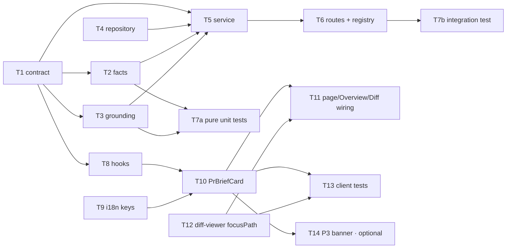

# Implementation Plan: PR Why + Risk Brief

## Overview

Add a model-authored brief to a PR's Overview tab that synthesizes the already-computed Intent (L03)
and Blast Radius (L04) data into one artifact, plus two new model-authored sections — **Risk areas**
(each risk pinned to a real file) and **Review focus** (an ordered `file:line — reason` reading list).
Exactly one `completeStructured` call per generation, fed only pre-computed facts (never diff patch
bodies), mandatorily grounded server-side against the PR's real files and changed lines before being
persisted into the already-existing-but-unwired `pr_brief` table.

Source: `specs/cross-module/SPEC-02-pr-why-risk-brief.md` (Spec ID SPEC-02, 35 EARS ACs).
**The spec header still says `Status: draft`** — content is final and user-approved; whoever approves
this plan should flip that header to `approved`. This plan does not touch `specs/`.

## Execution mode

**multi-agent (parallel)** — **assumed default, confirm.** `AskUserQuestion` is unavailable inside
this agent, so the mode could not be asked interactively. Multi-agent is the right default here: the
feature splits along four genuinely independent seams (shared contract; pure server helpers;
server module wiring; three client surfaces), and the only files more than one task would want are
`server/src/modules/index.ts` and `client/src/lib/hooks/index.ts` — each assigned to exactly one
task. So the plan is written for parallel execution: Phase 0 lands the contract alone, then every
concurrent task carries strictly non-overlapping `Owned paths` and an explicit `Depends-on`.

If **single-agent** is preferred instead, the same task order works top-to-bottom unchanged — only
the `Owned paths` non-overlap constraint becomes irrelevant.

## Requirements (verified)

Restated from `SPEC-02`. Every AC is cited by at least one task in the traceability table at the end.

**AC numbering note (verified against the spec):** the spec's **EARS section is authoritative**
(AC-1 … AC-35) and the **edge-cases table agrees with it**. The spec's *User stories* section carries
stale back-half AC references (e.g. story 1 cites "AC-23" for the Generate-brief empty state, which
is actually **AC-24**; story 9 cites "AC-15, AC-16" for grounding, which is actually **AC-17,
AC-18**; story 12 cites "AC-21" for rate limiting, which is actually **AC-16**). This plan traces
exclusively to the EARS numbering. Non-blocking — no requirement is lost, only mis-cited.

- **R1 (AC-1 – AC-7): Contract.** `PrBrief` gains required `summary: string`, `review_focus:
  ReviewFocusItem[]`, `missing_context: Array<'intent'|'blast'>`, `generated_for_sha: string`;
  `intent`/`blast` become `Intent | null` / `BlastRadius | null`; `ReviewFocusItem = { file: string,
  line: number | null, reason: string }`; `Risk`/`Risks`/`PrHistory` shapes unchanged and
  `history` is always `{ history: [] }`; `missing_context` is computed deterministically by the
  service, never authored by the LLM; the two vendored copies of `brief.ts` stay byte-identical.
- **R2 (AC-8, AC-9): Module and routes.** A new `brief` server module with a zero-LLM read path and a
  one-`completeStructured` generate path, registered in `server/src/modules/index.ts`.
- **R3 (AC-10 – AC-13): Fact assembly.** Facts = Intent record (if present) + Blast Radius summary
  and its listed changed-symbol/caller files (if present and not degraded) + PR file stats
  (path/additions/deletions) + Smart Diff role groups + PR title and description + the text of every
  Project Context document attached to the agent that produced the PR's **most recent review run**
  (its own attachments plus its enabled skills'). **Never** any file's patch or hunk body text.
  Absent Intent → `intent: null` + `'intent'` in `missing_context` + a system-prompt instruction not
  to invent a motivation; same for degraded/absent/non-existent Blast Radius. No review, or a review
  with no `agent_id` → zero documents, not an error.
- **R4 (AC-14 – AC-16): LLM call and cost control.** Exactly one `completeStructured` per generate
  request, model from `resolveFeatureModel(container, workspaceId, 'risk_brief')`; a zero-changed-
  files PR refuses with a "nothing to brief" result and issues **no** LLM call; the generate route is
  rate-limited the way `/pulls/:id/intent/recompute` already is.
- **R5 (AC-17, AC-18): Grounding — mandatory, not best-effort.** Every `risk.file_refs` entry and
  every `review_focus.file` must be a PR changed file **or** a Blast Radius changed-symbol/caller
  file; unknown paths are dropped before persisting; a risk left with zero `file_refs` is dropped
  entirely; a review-focus item whose only file is dropped is dropped entirely. A
  `review_focus.line` survives only if it falls within that file's actual changed-line ranges in
  this PR's diff, computed server-side from the already-persisted patch (never shown to the model);
  an ungroundable line becomes `null` with `file`/`reason` kept.
- **R6 (AC-19 – AC-22): Caching and regeneration.** Successful generate upserts the full grounded
  `PrBrief` (incl. `generated_for_sha`) into `pr_brief` keyed by `pr_id`, replacing any prior row;
  the read path returns the persisted brief with no LLM call and no recompute of Intent / Blast
  Radius / Smart Diff; reload shows the cached brief with no automatic regeneration; the refresh
  control always regenerates and overwrites, regardless of head-SHA change.
- **R7 (AC-23): Workspace scoping.** Both paths 404 for a PR in another workspace, matching `blast`
  and `intent`.
- **R8 (AC-24 – AC-27): UI, brief block.** Overview shows a PR Brief block: "Generate brief" action
  and nothing else when no brief has ever been generated; after generation, `summary` + Risk areas +
  Review focus; Intent and Blast Radius cards keep rendering independently from their own data
  sources; each `missing_context` entry gets an explicit note naming what's unavailable.
- **R9 (AC-28 – AC-30): UI, Risk areas.** Each risk row shows its `title` and ≥1 file from
  `file_refs`; the row's icon/indicator colour varies by `severity` with visually distinct colours;
  an empty `risks` array shows `brief.json`'s existing `noRisks` copy, not an empty section.
- **R10 (AC-31 – AC-34): UI, Review focus and navigation.** Items render as an ordered
  `file:line — reason` list in exact array order (never client-re-sorted); a `null` line renders as
  `file — reason` with no number; clicking an item switches the active tab to Files Changed and
  brings that file's card into view, expanded; a file not found among the rendered diff files still
  switches tab without a runtime error and without scrolling somewhere unrelated.
- **R11 (AC-35, P3, non-blocking): Optional banner.** The block *may* reuse `VerdictBanner`
  populated from the PR's most recent `kind: 'review'` record (verdict/score/findings/blockers) with
  its body text replaced by the brief's `summary`; its absence must never hide the required
  summary/risks/focus content.
- **R12 (non-functional): Untrusted inputs.** Project Context document texts **and** the PR's own
  title/description are wrapped with the codebase's one sanctioned mechanism (`wrapUntrusted`) and
  governed by the existing injection-guard line in the system prompt. No new wrapper, no new guard,
  no content filtering.

### Verified against the repo (every precedent the spec cites)

| Spec claim | Verified |
|---|---|
| `pr_brief` table exists, unwired | `server/src/db/schema/reviews.ts:61-66` (`prId` PK, `json` jsonb). **Already in migration `0000_init.sql:211`** — no new migration needed. |
| The two `brief.ts` copies are byte-identical today | `diff` of `server/src/vendor/shared/contracts/brief.ts` vs `client/src/vendor/shared/contracts/brief.ts` is empty. |
| `PrBrief` has no `summary`/`review_focus` and nothing populates it | `server/src/vendor/shared/contracts/brief.ts:129-135`. **Zero real consumers** — the only reference outside the contract itself is a passthrough type re-export at `client/src/lib/types.ts:35`. |
| `intent/` is the structural analog | `server/src/modules/intent/{routes,service,classifier,references}.ts`. One `completeStructured` at `classifier.ts:193`; `resolveFeatureModel` at `service.ts:172`. |
| Rate-limit precedent | `server/src/modules/intent/routes.ts:36` → `config: { rateLimit: { max: 10, timeWindow: '1 minute' } }`. `@fastify/rate-limit` is registered globally at `server/src/app.ts:96`. |
| Zero-files short-circuit precedent | `server/src/modules/blast/service.ts:21-29`. |
| Degraded-data contract precedent | `BlastRadiusResponse` at `server/src/vendor/shared/contracts/brief.ts:163-167` (`degraded`/`reason`). |
| `getIntent` read path | `ReviewRepository.getIntent` at `server/src/modules/reviews/repository.ts:134`. |
| Most-recent review + `agent_id` | `reviews.agentId` at `server/src/db/schema/reviews.ts:17`; `reviewsForPull` returns newest-first (`server/src/modules/reviews/repository/review.repo.ts:58-74`). |
| Project Context attachment resolution | `AgentsRepository.contextDocumentsFor` at `server/src/modules/agents/repository.ts:253`; `linkedSkills` at `:192`; `resolveProjectContext` at `server/src/modules/context/resolver.ts:73`; `readDocument` at `server/src/modules/context/clone-docs.ts:217`; the full resolve-with-fail-soft pattern at `server/src/modules/reviews/run-executor.ts:240-277`. |
| `risk_brief` feature-model slot | `FeatureModelId` enum at `server/src/vendor/shared/contracts/platform.ts:17`; registry entry (openai / gpt-4.1) at `:58-64`; `resolveFeatureModel` at `server/src/modules/settings/feature-models.ts:51`. |
| `PrFile.patch` is persisted per file | `prFiles.patch` at `server/src/db/schema/pulls.ts:44`. |
| Smart Diff is a pure, no-LLM helper | `buildSmartDiff` at `server/src/modules/reviews/smart-diff.ts:49`; service usage at `server/src/modules/reviews/service.ts:185-195`. |
| `groundFindings()` convention to mirror | `reviewer-core/src/grounding.ts:52`, with the file→changed-line index at `:24`. |
| `wrapUntrusted` is the one sanctioned mechanism | re-exported at `server/src/platform/prompt.ts:8`; used per-reference at `server/src/modules/intent/classifier.ts:87`. |
| `brief.json`'s `noRisks` exists | `client/messages/en/brief.json` → `"noRisks": "No notable risks flagged."` |
| `MockLLMProvider` can count calls + feed a fixture per schema name | `server/src/adapters/mocks.ts:59-111` (`calls[]`, `structuredBySchema`). **No change to `mocks.ts` is needed.** |

## Open questions & recommendations

Four decisions could not be asked interactively. Each has a **default already baked into the tasks
below**; overriding any of them changes only the task noted.

- **Q1 — Spec Open Question 1: no token/size budget for the assembled fact set.** A PR with hundreds
  of changed files or a large Blast Radius can overflow the context window and fail the single
  generate call outright. The Project Context resolver's byte budgets
  (`server/src/modules/context/constants.ts`) bound only the attached-documents portion.
  → **Default taken: cap deterministically** (T2). A `brief/constants.ts` caps the PR file list fed
  to the model (`MAX_PROMPT_FILES = 150`, ordered by Smart Diff role core→wiring→tests→docs→
  boilerplate then by churn descending) and the blast caller-file list (`MAX_PROMPT_BLAST_FILES =
  120`), each emitting an explicit `… and N more files omitted` line so the model knows the list is
  truncated. **The caps apply to the prompt only, never to the grounding allowlist** — the full
  untruncated PR + blast file sets remain the allowlist for AC-17, so truncation can never cause a
  legitimate reference to be dropped. Alternative (fail loudly, no cap) is one deleted constant file
  and one deleted sort in T2.
- **Q2 — the read/generate response envelope.** The spec pins the *behaviour* ("an explicit 'not
  generated yet' result distinguishable from a true 404", "a 'nothing to brief' result") but leaves
  the shape open. → **Default taken: discriminated unions** (T1):
  `BriefReadResponse = { status: 'ready', brief: PrBrief } | { status: 'not_generated' }` and
  `BriefGenerateResponse = { status: 'ready', brief: PrBrief } | { status: 'nothing_to_brief',
  reason: string }`. One 200 shape per route, narrowable client-side on `status`; wrong workspace
  still 404s via `NotFoundError`. This follows `object-discriminated-unions` and mirrors how
  `BlastRadiusResponse` carries its own degraded marker rather than leaning on HTTP status.
- **Q3 — how the review-focus target travels Overview → Files Changed (AC-33).** → **Default taken:
  a URL search param** `?tab=diff&file=<path>`, set through `page.tsx`'s existing `setParam` helper
  (`client/src/app/repos/[repoId]/pulls/[number]/page.tsx:66-72`), which is exactly how `?tab`,
  `?trace` and `?severity` already work on this page. Survives reload and back/forward, needs no
  lifted state. Alternative (lifted `useState` in `page.tsx`) changes only T11.
- **Q4 — Spec Open Question 2: no staleness indicator if Intent is recomputed after a brief exists.**
  The spec makes this an explicit non-goal and `generated_for_sha` provenance-only. → **Default
  taken: implement as specified** (no staleness UI). This has **no effect on task sequencing** —
  `generated_for_sha` is persisted (AC-6) so the indicator is a pure additive follow-up whenever it's
  wanted.

Recommendations (user decides; none of these rewrite a requirement):

- **Rec 1 — don't touch `reviewer-core` for line grounding.** `groundFindings` is the right
  *convention* to mirror, but it is shaped for `Finding` and the file→changed-line helper
  `buildLineIndex` (`reviewer-core/src/grounding.ts:24`) is **not exported from
  `reviewer-core/src/index.ts`** (only `groundFindings`/`groundingSummary`/`GroundingResult` are, at
  `:23`). Exporting it would violate the spec's "reviewer-core is not touched" non-goal for a
  ~12-line helper. → T3 owns its own pure `brief/grounding.ts`, which reuses the already-exported
  `diffFromPrFiles()` (`server/src/modules/reviews/diff-loader.ts:33`) to rebuild a `UnifiedDiff`
  **purely from the persisted `pr_files.patch`** — no git, no network, exactly AC-18's "computed
  server-side from the file's already-persisted patch" — and indexes
  `diff.files[].hunks[].newLineNumbers` (`server/src/vendor/shared/adapters.ts:175-188`) itself.
  Deliberately **not** `loadDiff()`, which would try a real `git diff` first and so add I/O and a
  failure mode the grounding gate must not have.
- **Rec 2 — accept one cross-module service import, and isolate it to one line.** AC-12 requires the
  brief to degrade when "the Blast Radius feature does not exist at all in the running fork". No code
  can detect a deleted module, so: `brief/service.ts` imports `BlastService` at exactly **one** import
  site and calls it inside a `try/catch` that maps *any* throw (plus any `degraded: true` response)
  to `blast: null` + `'blast'` in `missing_context`. A fork that deletes `blast/` then has exactly
  one import line and one call to remove. Same for Intent (`getIntent` returning `undefined`).
- **Rec 3 — `RoleGroup` must auto-open when it contains the focus file.** Neither the spec's
  navigation flowchart nor AC-33 mentions it, but Smart order is the **default** diff view
  (`DiffTab.tsx:40`) and `docs`/`boilerplate` role groups **start collapsed**
  (`RoleGroup.tsx:17-23`), while `FileCard` only auto-expands files under
  `AUTO_EXPAND_MAX_LINES` (`FileCard.tsx:49-51`). Without auto-opening both the group and the card,
  AC-33's "expanded and visible in the viewport" silently fails for any docs/boilerplate file or any
  large file. T12 covers both, on **both** render paths (`SmartDiffViewer` and the plain
  `DiffViewer`, since `DiffTab.tsx:110` falls back to the latter until `smartDiff` loads).
- **Rec 4 — defer the P3 banner (AC-35) to its own task and ship without it.** T14 is isolated and
  marked optional precisely so the required content lands first; AC-35 explicitly forbids the
  banner's absence from hiding anything.

## Affected modules & contracts

- **`@devdigest/shared` (both vendored copies)** — `brief.ts` extended: new `ReviewFocusItem`,
  `MissingContextKey`; `PrBrief` gains 4 fields and 2 nullable fields; new `BriefReadResponse` /
  `BriefGenerateResponse` response contracts. **This is an edit to an existing shared contract file
  — explicit callout:** it is mandated by AC-1/AC-4 and is safe because `PrBrief` has **zero real
  consumers** today (verified above); `Intent`, `BlastRadius`, `Risk`, `Risks`, `PrHistory`,
  `SmartDiff*`, `BlastRadiusResponse` and `ContextGap` are **not modified**, so no existing consumer
  of `brief.ts` is affected. Both copies must stay byte-identical (AC-2), enforced by a test.
- **`server` — new `server/src/modules/brief/`** — `routes.ts` (presentation), `service.ts`
  (application), `repository.ts` (`pr_brief` only, Drizzle), plus pure helpers `facts.ts`,
  `grounding.ts`, `llm-schema.ts`, `constants.ts`, and `index.ts`.
- **`server` — one shared file touched:** `server/src/modules/index.ts` (one import + one registry
  entry), owned solely by T6.
- **`server` — read-only consumers:** `reviews` (`container.reviewRepo` for `getPull`/`getRepo`/
  `getPrFiles`/`getIntent`/`reviewsForPull`; `buildSmartDiff`; `diffFromPrFiles`), `blast`
  (`BlastService.getForPr`), `agents` (`container.agentsRepo.contextDocumentsFor` + `linkedSkills`),
  `context` (`resolveProjectContext`, `readDocument`), `settings` (`resolveFeatureModel`).
  **No file in any of those modules is modified.**
- **`client` — new** `_components/PrBriefCard/` under the PR detail route, new
  `src/lib/hooks/brief.ts`, additive keys in `client/messages/en/brief.json`.
- **`client` — modified:** `page.tsx`, `OverviewTab/OverviewTab.tsx`, `DiffTab/DiffTab.tsx`, and the
  shared `src/components/diff-viewer/` set (`SmartDiffViewer`, `DiffViewer`, `RoleGroup`,
  `FileCard`) with one **optional** additive `focusPath` prop; `src/lib/hooks/index.ts` (one export).
- **No DB migration.** `pr_brief` already exists (`0000_init.sql:211`).
- **`reviewer-core` — not touched** (see Rec 1). **`e2e` — not touched.**

## Architecture changes

- `server/src/modules/brief/routes.ts` — **presentation**. Two handlers, each
  `getContext` → one service call → return. `IdParams` from `../_shared/schemas.js`. `POST` carries
  `config: { rateLimit: { max: 10, timeWindow: '1 minute' } }`. Never imports `drizzle-orm` or
  `db/schema.js`.
- `server/src/modules/brief/service.ts` — **application**. Takes `Container` (+ optional pino-style
  logger, like `IntentService`'s constructor at `intent/service.ts:31`). Owns: workspace scoping,
  the zero-files short-circuit, Project-Context resolution with fail-soft, Intent/Blast nullability
  and `missing_context` computation, `resolveFeatureModel` + the single `completeStructured`,
  invoking the grounding gate, composing the final `PrBrief`, upserting. Never imports `fastify`.
- `server/src/modules/brief/repository.ts` — **infrastructure**. `pr_brief` only: `getBriefJson`,
  `upsertBriefJson`. Returns/accepts `unknown` for the jsonb payload — **does not import
  `@devdigest/shared`**; the service does the `PrBrief.safeParse`. All cross-module reads go through
  `container.reviewRepo` / `container.agentsRepo` (already registered at
  `server/src/platform/container.ts:111,119`), never by importing another module's `repository.ts`.
- `server/src/modules/brief/{facts,grounding,llm-schema,constants}.ts` — **pure application
  helpers**, the role `intent/classifier.ts` plays: no DB, no network, no `Container`, every input
  injected. This is what makes the hard ACs (AC-11 no-patch-text, AC-17/AC-18 grounding, the caps)
  hermetically unit-testable with no Postgres and no LLM.
- `client` — RSC boundary unchanged: the PR detail route is already a `"use client"` leaf
  (`page.tsx:6`); `PrBriefCard` is a client component because it owns a mutation and a click
  handler. All server state goes through TanStack Query hooks in `src/lib/hooks/brief.ts` — no raw
  `fetch` in a component body.

## Dependency DAG

`T4`, `T9` and `T12` have no prerequisites and can start immediately alongside T1.

## Phased tasks

### Phase 0 — Contract (blocks most work)

- **T1 — Extend the `brief.ts` contract in both vendored copies**
  - **Action:** In **both** copies, byte-identically: add `ReviewFocusItem = z.object({ file:
    z.string(), line: z.number().int().nullable(), reason: z.string() })` and
    `MissingContextKey = z.enum(['intent','blast'])`. Replace the `PrBrief` object
    (currently `brief.ts:129-135`) with: `intent: Intent.nullable()`, `blast: BlastRadius.nullable()`,
    `risks: Risks`, `history: PrHistory`, `summary: z.string()`, `review_focus:
    z.array(ReviewFocusItem)`, `missing_context: z.array(MissingContextKey)`, `generated_for_sha:
    z.string()` — all required fields (nullable value ≠ optional field; `line` and `intent`/`blast`
    are **nullable, not `.optional()`**). Append the two route contracts as discriminated unions:
    `BriefReadResponse = z.discriminatedUnion('status', [z.object({status: z.literal('ready'),
    brief: PrBrief}), z.object({status: z.literal('not_generated')})])` and `BriefGenerateResponse
    = z.discriminatedUnion('status', [z.object({status: z.literal('ready'), brief: PrBrief}),
    z.object({status: z.literal('nothing_to_brief'), reason: z.string()})])`, each with its
    `z.infer` type export. **Do not** modify `Intent`, `ContextGap`, `ChangedSymbol`, `BlastCaller`,
    `DownstreamImpact`, `BlastRadius`, `RiskSeverity`, `Risk`, `Risks`, `PrHistoryItem`,
    `PrHistory`, any `SmartDiff*`, `BlastDegradedReason`, `PriorPr`, or `BlastRadiusResponse`.
    Add the byte-identity test.
  - **Module:** server + client (shared contract)
  - **Type:** core
  - **Skills to use:** `zod` (`type-export-schemas-and-types`, `object-optional-vs-nullable`,
    `object-discriminated-unions`, `schema-use-enums`), `typescript-expert`, `onion-architecture`
    (Boundary DTOs)
  - **Owned paths:** `server/src/vendor/shared/contracts/brief.ts`,
    `client/src/vendor/shared/contracts/brief.ts`, `server/test/brief-contracts.test.ts`
  - **Depends-on:** none
  - **Risk:** medium (edits an existing shared contract — see the explicit callout above)
  - **Known gotchas:** `client/INSIGHTS.md` — `z.number().default(0)` makes a contract field
    *required* at the type level; don't reach for `.default()` here, every new field is genuinely
    required. `server/INSIGHTS.md` — `contracts/platform.ts`'s existing text contains smart
    apostrophes; don't let an editor normalize unrelated characters in a nearby file and break
    byte-identity. The two copies must match **byte for byte**, including the trailing newline and
    comment wording — write one and copy the file, don't retype it.
  - **Acceptance:** `diff server/src/vendor/shared/contracts/brief.ts
    client/src/vendor/shared/contracts/brief.ts` exits 0 with no output (AC-2), *and*
    `server/test/brief-contracts.test.ts` asserts the same via `readFileSync` byte comparison and
    passes; `PrBrief.safeParse` succeeds on a payload with `intent: null`, `blast: null`,
    `missing_context: ['intent','blast']`, `history: { history: [] }`, `review_focus: [{file:'a.ts',
    line:null, reason:'r'}]`, `summary: 's'`, `generated_for_sha: 'abc'` (AC-1, AC-3, AC-4, AC-5,
    AC-6, AC-7) and **fails** when `summary` or `review_focus` is omitted (AC-1). `cd server &&
    pnpm typecheck` and `cd client && pnpm typecheck` both pass.

### Phase 1 — Server internals (T2, T3, T4 fully parallel)

- **T2 — Pure fact assembly + system prompt + prompt caps**
  - **Action:** Create `constants.ts` (`MAX_PROMPT_FILES = 150`, `MAX_PROMPT_BLAST_FILES = 120`,
    `SMART_DIFF_ROLE_PROMPT_ORDER`), `llm-schema.ts` (the **module-local** `BriefDraft` zod schema
    the model fills: `{ summary: z.string(), risks: Risks, review_focus: z.array(ReviewFocusItem) }`
    — importing `Risks`/`ReviewFocusItem` from `@devdigest/shared`; it deliberately does **not**
    include `intent`, `blast`, `missing_context`, `history` or `generated_for_sha`, which is the
    mechanical guarantee for AC-5), and `facts.ts` exporting `BRIEF_SYSTEM_PROMPT` and
    `assembleBriefFacts(input): { userMessage: string; missingContext: MissingContextKey[];
    allowedFiles: Set<string> }`. Every input is injected (no `Container`, no DB, no fetch), the way
    `intent/classifier.ts` is. Sections: PR title + description (each via `wrapUntrusted` from
    `../../platform/prompt.js`), `## Intent` or an explicit `Intent: unavailable` marker,
    `## Blast radius` summary + its changed-symbol/caller file list or an explicit
    `Blast radius: unavailable (<reason>)` marker, `## Changed files` (path, `+adds/-dels`, Smart
    Diff role — **paths and counts only**), `## Smart Diff groups`, `## Attached project context`
    (one `wrapUntrusted` block per document). The system prompt carries the data-only guard line
    (copy the convention from `intent/classifier.ts:109`) **and** an explicit instruction not to
    assert a motivation when the Intent fact is marked unavailable (AC-12). Apply the Q1 caps to the
    *prompt* lists only, emitting `… and N more files omitted`; return `allowedFiles` as the **full,
    untruncated** union of PR paths + blast changed-symbol/caller paths for the grounding gate.
  - **Module:** server
  - **Type:** core
  - **Skills to use:** `onion-architecture` (pure application helper, no Fastify/Drizzle),
    `typescript-expert`, `zod`, `security` (A05/ASI01 — untrusted text wrapped, prompt-injection
    guard reused unchanged, no new filtering)
  - **Owned paths:** `server/src/modules/brief/facts.ts`,
    `server/src/modules/brief/llm-schema.ts`, `server/src/modules/brief/constants.ts`
  - **Depends-on:** T1
  - **Known gotchas:** `server/INSIGHTS.md` — Intent's `context_gaps` was deliberately kept out of
    the LLM-facing schema; keep the same discipline (deterministic bookkeeping never goes into a
    model-facing schema), which is exactly why `missing_context` is absent from `BriefDraft`. The
    existing injection-guard mechanism is `wrapUntrusted` + the system-prompt line — do not invent a
    second wrapper (spec Untrusted-inputs section).
  - **Acceptance:** a unit test (T7a) proves the assembled `userMessage` for a fixture whose
    `prFiles[].patch` contains the literal strings `+const SECRET` and `@@ -1,5 +1,9 @@` contains
    **neither** (AC-11); contains all five fact categories for the "intent present + non-degraded
    blast + 3 files + 2 specs" fixture (AC-10); contains `Intent: unavailable` and returns
    `missingContext: ['intent']` when `intent` is null, and the same for `blast` (AC-12); every
    document text and the PR title/body appear inside `<untrusted …>` blocks (R12); a 400-file
    fixture produces exactly `MAX_PROMPT_FILES` file lines plus one `…omitted` line while
    `allowedFiles.size === 400` (Q1). `cd server && pnpm typecheck` passes.

- **T3 — Pure grounding gate (AC-17, AC-18)**
  - **Action:** Create `server/src/modules/brief/grounding.ts` exporting
    `buildChangedLineIndex(diff: UnifiedDiff): Map<string, Set<number>>` (iterate
    `diff.files[].hunks[].newLineNumbers`, falling back to the hunk's declared `newStart`/`newLines`
    range exactly as `reviewer-core/src/grounding.ts:24-39` does) and
    `groundBrief(draft: BriefDraft, opts: { allowedFiles: Set<string>; changedLines: Map<string,
    Set<number>> }): { risks: Risk[]; review_focus: ReviewFocusItem[]; dropped: { kind: 'risk' |
    'focus' | 'file_ref' | 'line'; detail: string }[] }`. Rules, in order: filter each risk's
    `file_refs` to `allowedFiles`; drop the risk entirely if it is then empty; drop a review-focus
    item whose `file` is not in `allowedFiles`; keep a surviving item's `line` only if
    `changedLines.get(file)?.has(line)`, otherwise set it to `null` while keeping `file` and
    `reason`. Preserve the model's `review_focus` array order (it is the reading order, AC-31) and
    the risks' order. Do **not** import `fastify`, `drizzle-orm`, `Container`, or anything from
    `reviewer-core` — see Rec 1.
  - **Module:** server
  - **Type:** core
  - **Skills to use:** `onion-architecture` (innermost-ring purity), `typescript-expert`, `security`
    (grounding is the control that stops a successful prompt injection from persisting a fabricated
    reference)
  - **Owned paths:** `server/src/modules/brief/grounding.ts`
  - **Depends-on:** T1
  - **Known gotchas:** A **blast-only** file is in `allowedFiles` but has **no** entry in
    `changedLines` (it isn't in this PR's diff), so its line is *always* nulled — that is correct per
    AC-18 ("within that file's actual changed-line ranges in this PR's diff"), not a bug; cover it
    with an explicit test so a future reader doesn't "fix" it. `newLineNumbers` can be empty on a
    pure-deletion hunk — the fallback range must still run.
  - **Acceptance:** unit tests (T7a) prove: a draft citing `src/fake/not-real.ts` yields that ref
    dropped and, when it was the risk's only ref, the whole risk absent (AC-17); a focus item whose
    only file is unknown is absent entirely (AC-17); a focus item with `line` outside the file's
    changed ranges comes back with `line: null` and its `file`/`reason` intact (AC-18); a
    blast-only file's focus item survives with `line: null`; `review_focus` order is byte-identical
    to the input order minus drops (AC-31). `cd server && pnpm typecheck` passes.

- **T4 — `pr_brief` repository**
  - **Action:** Create `server/src/modules/brief/repository.ts` with `class BriefRepository {
    constructor(private readonly db: Db) {} }` and two methods: `getBriefJson(prId: string):
    Promise<unknown | undefined>` (select `prBrief.json` where `prId`) and `upsertBriefJson(prId:
    string, json: unknown): Promise<void>` (insert … `onConflictDoUpdate({ target: t.prBrief.prId,
    set: { json } })`). Drizzle-only, no business rules, **no `@devdigest/shared` import** — the
    service owns the `PrBrief.safeParse`. No migration: `pr_brief` already exists
    (`server/src/db/schema/reviews.ts:61`, `0000_init.sql:211`).
  - **Module:** server
  - **Type:** backend
  - **Skills to use:** `drizzle-orm-patterns` (upsert via `onConflictDoUpdate`),
    `onion-architecture` (Repository layer rules), `postgresql-table-design` (read-only here — the
    table exists; confirm `prId` is the PK so `onConflictDoUpdate` has its unique target)
  - **Depends-on:** none
  - **Risk:** low
  - **Known gotchas:** `onConflictDoNothing` would silently fail AC-19's "replacing any prior row" —
    `server/INSIGHTS.md` already records that exact mistake for `agent_skills`. Must be
    `onConflictDoUpdate`.
  - **Owned paths:** `server/src/modules/brief/repository.ts`
  - **Acceptance:** covered by the T7b integration test — generating twice for the same PR leaves
    exactly one `pr_brief` row whose `json` equals the second brief (AC-19). `cd server && pnpm
    typecheck` passes.

### Phase 2 — Server orchestration

- **T5 — `BriefService`**
  - **Action:** Create `server/src/modules/brief/service.ts`, constructor `(private container:
    Container, logger?: Logger)` mirroring `intent/service.ts:31`, holding `new
    BriefRepository(container.db)` and using `container.reviewRepo` for every cross-module read.
    Two public methods:
    `read(workspaceId, prId): Promise<BriefReadResponse>` — `reviewRepo.getPull(workspaceId, prId)`,
    `NotFoundError` when absent (AC-23); `repo.getBriefJson(prId)`; `PrBrief.safeParse` → `{status:
    'ready', brief}` on success, `{status: 'not_generated'}` when there is no row (and also when the
    stored row fails to parse, logged at `warn` — a brief written by an older shape must not 500 the
    Overview tab). **Zero** LLM calls, no Intent/Blast/Smart-Diff recompute (AC-8, AC-20).
    `generate(workspaceId, prId): Promise<BriefGenerateResponse>` — in order:
    (1) `getPull` → `NotFoundError` if absent (AC-23); `getRepo(pull.repoId)`.
    (2) `reviewRepo.getPrFiles(prId)`; if empty → return `{status:'nothing_to_brief', reason: …}`
    **before** touching the LLM (AC-15), mirroring `blast/service.ts:21-29`.
    (3) Project Context: `reviewRepo.reviewsForPull(prId)` (newest-first) → `rows[0]?.review.agentId`;
    when null/absent → `specs = []`, **not an error** (AC-13). Otherwise
    `container.agentsRepo.contextDocumentsFor(agentId)` + `container.agentsRepo.linkedSkills(agentId)`
    filtered to `l.skill.enabled`, then `resolveProjectContext({ agentPaths, skillPathLists, read:
    (p) => readDocument(container.git.clonePathFor({owner, name}), p) })` — the whole block inside
    one `try/catch` that degrades to `specs = []`, copying the fail-soft shape at
    `reviews/run-executor.ts:240-277`.
    (4) `reviewRepo.getIntent(prId)` → strip `pr_id`/`context_gaps` to a bare `Intent`, or `null`.
    (5) Blast: `new BlastService(container).getForPr(prId, workspaceId)` inside `try/catch`; map a
    throw **or** `degraded === true` to `null` (Rec 2). Keep this to one import site and one call.
    (6) `buildSmartDiff(...)` from `../reviews/smart-diff.js` (pure, no LLM) using the PR files and
    the newest review's findings, same call shape as `reviews/service.ts:185-195`.
    (7) `assembleBriefFacts(...)` → `{ userMessage, missingContext, allowedFiles }`.
    (8) `resolveFeatureModel(container, workspaceId, 'risk_brief')` → `container.llm(provider)` →
    **exactly one** `llm.completeStructured({ model, schema: BriefDraft, schemaName: 'BriefDraft',
    messages: [system, user], temperature: 0.1 })` (AC-14). A provider or validation failure
    propagates — **nothing is persisted** on failure.
    (9) `diffFromPrFiles(container.reviewRepo, prId)` → `buildChangedLineIndex` → `groundBrief`
    (AC-17, AC-18), logging the dropped list the way the review pipeline logs grounding.
    (10) Compose the `PrBrief`: grounded `summary`/`risks`/`review_focus`, `intent`, `blast`,
    `history: { history: [] }` (AC-7), `missing_context` from step 7 — **computed, never from the
    model** (AC-5) — and `generated_for_sha: pull.headSha` (AC-6).
    (11) `PrBrief.parse(...)` then `repo.upsertBriefJson(prId, brief)` (AC-19); return `{status:
    'ready', brief}`. No "did the SHA change?" check anywhere — every generate is a full
    regeneration (AC-22).
  - **Module:** server
  - **Type:** backend
  - **Skills to use:** `onion-architecture` (Service + Composition-root rules: adapters only via
    `container.llm` / `container.git` / `container.agentsRepo` / `container.reviewRepo`, never
    `new SomeAdapter()`), `fastify-best-practices` (error-handling conventions, `NotFoundError`),
    `typescript-expert`, `security` (A01 workspace scoping on both paths; A05/ASI09 — grounded
    output only, model claims never trusted)
  - **Owned paths:** `server/src/modules/brief/service.ts`
  - **Depends-on:** T1, T2, T3, T4
  - **Risk:** high (the feature's whole orchestration, and the one place AC-8/AC-14/AC-15's
    call-count guarantees can be broken)
  - **Known gotchas:** `server/INSIGHTS.md` — `blast` is a thin wrap over
    `repoIntel.getBlastRadius`, so a repo that was never indexed returns `degraded`, **not** a
    throw; both paths must map to `blast: null`. Project-context resolution against
    `MockGitClient`'s fake clone path yields a non-existent directory, so documents resolve as
    `missing` in hermetic tests — that is the expected hermetic behaviour (`server/INSIGHTS.md`:
    testing injection end-to-end needs a *real* clone dir); don't let the test chase it.
    `resolveProjectContext` never throws by contract, but `readDocument` and `clonePathFor` can —
    hence the outer `try/catch`.
  - **Acceptance:** covered by T7b. Measurable: with a `MockLLMProvider`, `read()` on a PR with no
    brief leaves `mock.calls` with **zero** `completeStructured` entries (AC-8, AC-20);
    `generate()` on a normal PR leaves **exactly one** (AC-8, AC-14); `generate()` on a 0-file PR
    leaves **zero** and returns `status: 'nothing_to_brief'` (AC-15); a PR with no `pr_intent` row
    produces `intent: null` and `missing_context` containing `'intent'` (AC-5, AC-12); a PR with
    zero reviews generates successfully (AC-13); the persisted `json.history.history` is `[]`
    (AC-7) and `json.generated_for_sha === pull.headSha` (AC-6). `cd server && pnpm typecheck`
    passes.

- **T6 — Routes + module registration**
  - **Action:** Create `server/src/modules/brief/routes.ts` (default-export Fastify plugin,
    `appBase.withTypeProvider<ZodTypeProvider>()`, modeled on `intent/routes.ts`):
    `GET /pulls/:id/brief` with `{ schema: { params: IdParams } }` → `getContext` →
    `new BriefService(app.container, req.log).read(workspaceId, req.params.id)`;
    `POST /pulls/:id/brief/generate` with `{ schema: { params: IdParams }, config: { rateLimit: {
    max: 10, timeWindow: '1 minute' } } }` → `getContext` → `…generate(...)` (AC-16). Create
    `server/src/modules/brief/index.ts` (`export { default } from './routes.js';`, matching
    `blast/index.ts`). Register in `server/src/modules/index.ts`: one `import brief from
    './brief/routes.js';` and one `brief,` entry (AC-9). No `drizzle-orm` / `db/schema.js` import in
    the route file.
  - **Module:** server
  - **Type:** backend
  - **Skills to use:** `fastify-best-practices` (routes, schemas, plugin registration),
    `onion-architecture` (Route-layer rules — the handler body is `getContext` → one service call →
    return), `zod`
  - **Owned paths:** `server/src/modules/brief/routes.ts`, `server/src/modules/brief/index.ts`,
    `server/src/modules/index.ts`
  - **Depends-on:** T5
  - **Risk:** low
  - **Known gotchas:** modules are registered **statically** — there is no filesystem autoload
    (root `CLAUDE.md`), so a missing registry entry fails silently as a 404 rather than a build
    error. ESM: relative imports carry the `.js` extension. Declaring a `response` schema is
    optional here but, if added, `fastify-type-provider-zod` will **strip** anything the schema
    doesn't describe — prefer no response schema over a partial one.
  - **Acceptance:** `cd server && pnpm exec vitest run routes-smoke` still passes; the T7b
    integration test reaches both routes (not 404) and a cross-workspace PR id returns **404** on
    both (AC-23); the 11th POST within one minute is rejected with 429 and leaves `mock.calls`
    unchanged (AC-16). `cd server && pnpm typecheck` passes.

### Phase 3 — Server tests

- **T7a — Hermetic unit tests for the pure helpers**
  - **Action:** `server/test/brief-facts.test.ts` and `server/test/brief-grounding.test.ts`. No
    Postgres, no LLM, no clone — call `assembleBriefFacts` / `groundBrief` / `buildChangedLineIndex`
    directly with fixtures, the way `blast-service.test.ts` and `grounding.test.ts` do. Cover every
    acceptance bullet listed under T2 and T3, including the AC-11 "patch text never appears" assertion
    and the blast-only-file null-line case.
  - **Module:** server
  - **Type:** backend
  - **Skills to use:** `typescript-expert`, `zod`
  - **Owned paths:** `server/test/brief-facts.test.ts`, `server/test/brief-grounding.test.ts`
  - **Depends-on:** T2, T3
  - **Risk:** low
  - **Known gotchas:** these must stay in the **unit** lane, so the filenames must **not** end in
    `.it.test.ts` (`TESTING.md`: the unit lane excludes that glob).
  - **Acceptance:** `cd server && pnpm exec vitest run brief-facts brief-grounding` passes with no
    Docker running.

- **T7b — Integration test for the routes**
  - **Action:** `server/test/brief.it.test.ts` — real Postgres via testcontainers + `buildApp`,
    following `server/test/reviews.it.test.ts`'s setup and self-skip-without-Docker convention.
    Inject a `MockLLMProvider` via `overrides.llm` with `structuredBySchema: { BriefDraft: … }` and
    assert on its `calls` array. Scenarios: read-before-generate → `status: 'not_generated'`, zero
    `completeStructured` calls; generate → `status: 'ready'`, exactly one call, one `pr_brief` row;
    read again → same brief, still one total call (AC-20, AC-21); generate again (same head SHA) →
    two calls total, still one row, row replaced (AC-19, AC-22); 0-file PR → `nothing_to_brief`, no
    extra call (AC-15); PR with no `pr_intent` row → `intent: null` + `missing_context` includes
    `'intent'` (AC-12); PR with zero reviews → success (AC-13); a fixture draft citing a bogus path
    and an out-of-range line → neither survives into the stored row (AC-17, AC-18); cross-workspace
    PR id → 404 on both routes (AC-23).
  - **Module:** server
  - **Type:** backend
  - **Skills to use:** `fastify-best-practices` (testing via `inject()`), `drizzle-orm-patterns`
  - **Owned paths:** `server/test/brief.it.test.ts`
  - **Depends-on:** T6
  - **Risk:** medium
  - **Known gotchas:** `server/INSIGHTS.md` flags `reviews.it.test.ts` and
    `context-injection.it.test.ts` as **already flaky on this machine / under concurrent implementer
    load**, independent of any code change — do not treat a pre-existing failure in a *sibling* `.it`
    file as a regression from this task. Never run `docker compose down -v` (root `CLAUDE.md`:
    it wipes `devdigest_pgdata`); use `./scripts/e2e.sh` for a disposable stack.
  - **Acceptance:** `cd server && pnpm exec vitest run brief.it.test` passes with Docker available
    and self-skips without it.

### Phase 4 — Client (T8, T9, T12 parallel; T9 and T12 can start immediately)

- **T8 — TanStack Query hooks**
  - **Action:** Create `client/src/lib/hooks/brief.ts` (`"use client"`): `usePrBrief(prId)` →
    `useQuery({ queryKey: ['pr-brief', prId], queryFn: () => api.get<BriefReadResponse>(
    `/pulls/${prId}/brief`), enabled: prId != null })` — **no** `refetchInterval`, no automatic
    generate (AC-21); and `useGenerateBrief(prId)` → `useMutation({ mutationFn: () =>
    api.post<BriefGenerateResponse>(`/pulls/${prId}/brief/generate`), onSuccess: (data) => { if
    (data.status === 'ready') qc.setQueryData(['pr-brief', prId], data); } })`, mirroring
    `hooks/intent.ts:18-24`. Add `export * from "./brief";` to `client/src/lib/hooks/index.ts`.
  - **Module:** client
  - **Type:** ui
  - **Skills to use:** `frontend-architecture` (Business-logic placement: all server communication
    through a hook over the shared `lib/api` client), `react-best-practices` (Data fetching),
    `typescript-expert`
  - **Owned paths:** `client/src/lib/hooks/brief.ts`, `client/src/lib/hooks/index.ts`
  - **Depends-on:** T1
  - **Risk:** low
  - **Known gotchas:** keep the query key a stable `['pr-brief', prId]` tuple; the mutation writes
    the ready response straight into the cache (like `useRecomputeIntent`) so the refresh path needs
    no refetch round-trip, and must **not** invalidate on a `nothing_to_brief` result.
  - **Acceptance:** `cd client && pnpm typecheck` passes; narrowing `data.status === 'ready'` gives
    `data.brief: PrBrief` with no cast at the call site.

- **T9 — i18n keys**
  - **Action:** Additively extend `client/messages/en/brief.json` with the keys the new UI needs,
    under one new `card` (or similar) group: generate-action label, refresh label + aria-label,
    generating/pending copy, empty-state hint, summary / risk-areas / review-focus section labels,
    `missingIntent` and `missingBlast` notes (AC-27), `nothingToBrief`, `error`, and the
    review-focus item aria-label. **Keep `noRisks` exactly as it is** — AC-30 requires reusing it.
    Do not touch `block.*`, `noHistory`, `overlap`, `unavailable*`, or `why.*`.
  - **Module:** client
  - **Type:** ui
  - **Skills to use:** `frontend-architecture` (Constants placement)
  - **Owned paths:** `client/messages/en/brief.json`
  - **Depends-on:** none
  - **Risk:** low
  - **Known gotchas:** `client/src/i18n/request.ts:16-25` auto-loads **every** `messages/en/*.json`
    as a namespace — no registration file to edit and **no shared-file contention**. `client/INSIGHTS.md`
    — there are two unrelated "Intent" i18n homes (`brief.json`'s `block.intent` vs
    `prReview.json`'s `intent.*`); the new brief keys belong in **`brief.json`**, and the existing
    Intent/Blast *cards* keep using their own namespaces untouched (AC-26).
  - **Acceptance:** `node -e "JSON.parse(require('fs').readFileSync('client/messages/en/brief.json','utf8'))"`
    succeeds; `git diff` shows only additions plus no change to the `noRisks` line; `cd client &&
    pnpm test` still passes.

- **T12 — Optional `focusPath` support in the shared diff viewer**
  - **Action:** Thread one **optional** prop through, additively — no existing call site breaks:
    `FileCard` gains `focusPath?: string | null`; when `focusPath === file.path` it force-opens
    (`React.useEffect` setting `open` to `true` when the prop changes to a match) and scrolls its
    root element into view via a `ref` + `scrollIntoView({ block: 'start' })`; when `focusPath` is
    absent or doesn't match, behaviour is byte-for-byte what it is today (AC-34 — no scroll to an
    unrelated location). `RoleGroup` gains `focusPath?: string | null`, forwards it to its
    `FileCard`s, **and force-opens itself when `group.files.some(f => f.path === focusPath)`**
    (Rec 3 — `docs`/`boilerplate` start collapsed at `RoleGroup.tsx:17-23`).
    `SmartDiffViewer` and `DiffViewer` each gain `focusPath?: string | null` and forward it.
  - **Module:** client
  - **Type:** ui
  - **Skills to use:** `react-best-practices` (useEffect is legitimate here — it synchronizes an
    *external* system, the DOM scroll position; Accessibility), `frontend-architecture` (shared
    component placement — these stay in `src/components/diff-viewer/`), `typescript-expert`
  - **Owned paths:** `client/src/components/diff-viewer/FileCard/FileCard.tsx`,
    `client/src/components/diff-viewer/RoleGroup/RoleGroup.tsx`,
    `client/src/components/diff-viewer/SmartDiffViewer/SmartDiffViewer.tsx`,
    `client/src/components/diff-viewer/DiffViewer/DiffViewer.tsx`
  - **Depends-on:** none
  - **Risk:** medium (shared components on the main review surface; a regression here breaks the
    Files Changed tab for everyone)
  - **Known gotchas:** `client/INSIGHTS.md` — shared `diff-viewer/*` components must stay on the
    **`"shell"`** i18n namespace, not `"prReview"`; this task should need **no new strings at all**.
    `jsdom` does **not** implement `Element.prototype.scrollIntoView` — a test must stub it
    (`vi.fn()` on the prototype) or the component must call it defensively; guard with
    `el?.scrollIntoView?.(…)` so a missing implementation can never throw (that guard *is* AC-34's
    "no runtime error"). `DiffTab.tsx:110` renders `DiffViewer`, not `SmartDiffViewer`, whenever
    `smartOrder` is off **or** `smartDiff` hasn't loaded yet — both paths must honour `focusPath`.
  - **Acceptance:** `cd client && pnpm test` passes unchanged (every existing `diff-viewer` and
    `DiffTab` test keeps passing with no edits, proving the prop is additive); T13's new test proves
    a focus-matched file card renders expanded and called `scrollIntoView`, a collapsed-by-default
    `docs` group containing the target opens, and an unmatched `focusPath` triggers **no**
    `scrollIntoView` call and no throw (AC-33, AC-34). `cd client && pnpm typecheck` passes.

### Phase 5 — The PR Brief block

- **T10 — `PrBriefCard`**
  - **Action:** Create `client/src/app/repos/[repoId]/pulls/[number]/_components/PrBriefCard/` with
    `PrBriefCard.tsx`, `RiskRow.tsx`, `ReviewFocusList.tsx`, `constants.ts`, `styles.ts`,
    `index.ts`. `PrBriefCard` props: `{ prId: string | null; onFocusFile: (file: string) => void }`.
    States, as early returns: loading → `Skeleton`s; `status: 'not_generated'` → a short hint plus a
    single **Generate brief** `Button` and **no** risk/focus content (AC-24); mutation pending →
    the button in `loading` state; `status: 'nothing_to_brief'` → that message, no LLM retry loop;
    error → the `brief.json` error copy. Ready → `summary` paragraph, one explicit note per
    `missing_context` entry naming what's unavailable (AC-27), a **Risk areas** section rendering
    `RiskRow` per risk (title + ≥1 `file_refs` path, severity-coloured indicator) or `t('noRisks')`
    when `risks.risks` is empty (AC-28, AC-29, AC-30), and a **Review focus** section rendering
    `review_focus` in **exact array order** — never `.sort()` — each item a button labelled
    `file:line — reason`, or `file — reason` when `line === null` (AC-31, AC-32), calling
    `onFocusFile(item.file)` on click. A refresh `IconBtn`/`Button` in the section header always
    calls the generate mutation (AC-22). `constants.ts` holds the severity→CSS-token map following
    `FindingCard/constants.ts:4-12`'s `SEV_COLOR` shape — distinct tokens for `high`/`medium`/`low`
    plus a fallback, since `Risk.kind` and severity are free-form-ish at the contract level.
  - **Module:** client
  - **Type:** ui
  - **Skills to use:** `frontend-architecture` (colocated `_components/<Name>/` folder; split along
    one axis — constants/styles out first), `react-best-practices` (early returns for
    loading/error/empty; derive don't store; no render factories; `aria-label` on icon-only buttons;
    `key` from the stable file path, not the array index, where paths are unique), `next-best-practices`
    (`"use client"` only on this leaf), `typescript-expert`
  - **Owned paths:** `client/src/app/repos/[repoId]/pulls/[number]/_components/PrBriefCard/**`
  - **Depends-on:** T8, T9
  - **Risk:** medium
  - **Known gotchas:** `client/INSIGHTS.md` — `@devdigest/ui`'s `Chip` renders a real `<button>` and
    cannot nest inside a clickable row (review-focus items are clickable rows: don't put a `Chip`
    inside one); `IconBtn` has **no `disabled` prop`** — use `Button` if the refresh control must be
    disabled while pending; `@devdigest/ui` already ships a safe `Markdown` primitive, so do **not**
    hand-roll `react-markdown` if `summary` is rendered as Markdown (plain text is also acceptable
    per the spec's Untrusted-inputs closing note). Use `{risks.length > 0 && …}`, never
    `{risks.length && …}` — a `0` would render literally.
  - **Acceptance:** T13's tests. Measurable: a `not_generated` fixture renders the Generate button
    and **no** risk/focus headings (AC-24); after a mocked successful generate, summary + Risk areas
    + Review focus are all visible with no further interaction (AC-25); `missing_context:
    ['intent']` renders a visible "Intent not available"-style note independent of the summary text
    (AC-27); every rendered risk row shows a non-empty title and ≥1 file path (AC-28); a `high` and
    a `low` risk render with **different** indicator colours (AC-29); `risks: []` renders the exact
    `noRisks` string (AC-30); `review_focus[0]` is the first rendered item (AC-31); a `line: null`
    item's accessible label contains no digits from a line number (AC-32). `cd client && pnpm
    typecheck` passes.

### Phase 6 — Wiring and navigation

- **T11 — Page / Overview / DiffTab wiring**
  - **Action:** `page.tsx`: read `const focusFile = search.get("file")`; pass
    `onFocusFile={(file) => { const sp = new URLSearchParams(search.toString()); sp.set("tab",
    "diff"); sp.set("file", file); router.replace(…); }}` into `OverviewTab` (one atomic
    `router.replace` so tab and file land together — two sequential `setParam` calls would race and
    can drop the first); pass `focusPath={focusFile}` into `DiffTab`. **Clear the `file` param when
    the user leaves the diff tab** so a later manual visit doesn't re-scroll.
    `OverviewTab.tsx`: accept `onFocusFile`, render `<PrBriefCard prId={prId}
    onFocusFile={onFocusFile} />` in the layout — **full-width above** the existing Intent/Blast
    grid, matching the spec's screenshot description (2) — and leave the existing `IntentCard` and
    `BlastRadiusCard` render paths **completely untouched** (AC-26).
    `DiffTab.tsx`: accept `focusPath?: string | null` and forward it to both `SmartDiffViewer` and
    `DiffViewer`. Extend the existing `DiffTab.test.tsx` for the forwarding.
  - **Module:** client
  - **Type:** ui
  - **Skills to use:** `next-best-practices` (App Router navigation hooks, Suspense/`useSearchParams`
    rules), `frontend-architecture` (route-level shared state lives next to `page.tsx`, not
    duplicated into each `_components/` folder), `react-best-practices` (URL-dependent state belongs
    in search params, not component state), `typescript-expert`
  - **Owned paths:** `client/src/app/repos/[repoId]/pulls/[number]/page.tsx`,
    `client/src/app/repos/[repoId]/pulls/[number]/_components/OverviewTab/OverviewTab.tsx`,
    `client/src/app/repos/[repoId]/pulls/[number]/_components/DiffTab/DiffTab.tsx`,
    `client/src/app/repos/[repoId]/pulls/[number]/_components/DiffTab/DiffTab.test.tsx`
  - **Depends-on:** T10, T12
  - **Risk:** medium (edits the PR detail page every other tab renders through)
  - **Known gotchas:** the file path contains `/` and must survive the round trip — rely on
    `URLSearchParams`' own encoding, never hand-roll it. `OverviewTab` currently takes four props;
    adding a fifth keeps it within the 5–7 prop guideline — if more are needed later that's the
    signal to group them, not to keep appending. Do **not** change `OverviewTab`'s existing
    `useTranslations("prReview")` / `useTranslations("blast")` namespaces.
  - **Acceptance:** `cd client && pnpm test` passes (incl. the extended `DiffTab.test.tsx` asserting
    `focusPath` reaches the viewer); `cd client && pnpm typecheck` passes. Manual/e2e-observable:
    clicking the review-focus entry for a file lands on `?tab=diff&file=<path>` with that file's
    card visible on screen (AC-33).

### Phase 7 — Client tests

- **T13 — Component tests**
  - **Action:** `PrBriefCard/PrBriefCard.test.tsx` — 3–4 flow tests covering every T10 acceptance
    bullet, wrapping in `NextIntlClientProvider` with `messages={{ brief: briefMessages }}` imported
    from `client/messages/en/brief.json` (the convention every sibling test uses, e.g.
    `BlastRadiusCard.test.tsx:5`), and mocking `@/lib/hooks/brief` (or `fetch`) rather than the
    component under test. New `client/src/components/diff-viewer/FileCard/FileCard.test.tsx` —
    focus-match expands + scrolls, non-match does neither and does not throw (AC-33, AC-34), with
    `Element.prototype.scrollIntoView` stubbed via `vi.fn()`.
  - **Module:** client
  - **Type:** ui
  - **Skills to use:** `react-testing-library` (fewer, longer flow tests; `getByRole` first;
    `userEvent.setup()`; never `fireEvent`), `react-best-practices`
  - **Owned paths:**
    `client/src/app/repos/[repoId]/pulls/[number]/_components/PrBriefCard/PrBriefCard.test.tsx`,
    `client/src/components/diff-viewer/FileCard/FileCard.test.tsx`
  - **Depends-on:** T10, T12
  - **Risk:** low
  - **Known gotchas:** `client/INSIGHTS.md` — rendering a component that calls `useTranslations`
    **without** `NextIntlClientProvider` breaks the test; `@devdigest/ui`'s `Checkbox` trips
    axe-core's `button-name` rule (not used here, but don't add an axe pass expecting a clean sheet);
    `vi.fn().mock.calls[0][0]` fails strict-mode typecheck — destructure with a local type instead.
    `FileCard` uses the **`"shell"`** namespace, so its test must provide `shell` messages, not
    `prReview`.
  - **Acceptance:** `cd client && pnpm test` passes, including the new files; `cd client && pnpm
    typecheck` passes.

### Phase 8 — Optional (P3)

- **T14 — `VerdictBanner` combined banner (AC-35) — OPTIONAL, ship without it**
  - **Action:** In `PrBriefCard`, when a `kind: 'review'` review exists for the PR, render the
    existing `VerdictBanner` (`_components/VerdictBanner/VerdictBanner.tsx`) above the block with
    the review's `verdict`/`score`/findings count/blocker count and `summary={brief.summary}`. Source
    the review from the already-fetched `usePrReviews(prId)` data via a prop from `OverviewTab` —
    **do not** add a second fetch. If no review exists, render nothing extra; the required
    summary/risks/focus content must be unaffected either way.
  - **Module:** client
  - **Type:** ui
  - **Skills to use:** `react-best-practices` (composition over branching props),
    `frontend-architecture`
  - **Owned paths:** `client/src/app/repos/[repoId]/pulls/[number]/_components/PrBriefCard/PrBriefCard.tsx`
    (shared with T10 — **must run after T10 completes, never concurrently**)
  - **Depends-on:** T10 (and T11 for the review data prop, if sourced that way)
  - **Risk:** low
  - **Known gotchas:** `VerdictBanner` requires a non-optional `verdict: Verdict` and renders
    `summary` only when truthy (`VerdictBanner.tsx:48`) — a `summary`-only banner with no review is
    not a valid use of it, which is exactly why AC-35 is conditional on a review existing.
  - **Acceptance:** a PR fixture with both a review and a brief renders the banner; a PR fixture
    with only a brief renders summary + Risk areas + Review focus with **no** banner and no error
    (AC-35). `cd client && pnpm test` and `pnpm typecheck` pass.

## Testing strategy

Per `TESTING.md`'s per-package suites — typological, not exhaustive.

- **server-unit (hermetic, no Docker)** — `cd server && pnpm exec vitest run --exclude
  '**/*.it.test.ts'`. Carries T7a (`brief-facts.test.ts`, `brief-grounding.test.ts`) and T1's
  `brief-contracts.test.ts`. This lane owns the ACs that are *pure functions*: AC-1 – AC-7
  (contract), AC-11 (no patch text), AC-17/AC-18 (grounding), and the Q1 caps.
- **server-integration (real Postgres)** — `cd server && pnpm exec vitest run brief.it.test`
  (self-skips without Docker). Carries T7b. This lane owns the ACs that are *wiring and
  call-counting*: AC-8, AC-9, AC-12 – AC-16, AC-19 – AC-23. `MockLLMProvider.calls` is the
  mechanism for every "exactly one / zero LLM calls" assertion — no real key, no network.
- **client (vitest + jsdom + RTL)** — `cd client && pnpm test`. Carries T13 plus the extended
  `DiffTab.test.tsx`. Owns AC-24 – AC-34 and, if built, AC-35.
- **Typecheck, every package touched** — `cd server && pnpm typecheck`, `cd client && pnpm
  typecheck`. Non-negotiable for T1, which changes a contract both packages compile against.
- **reviewer-core and e2e** — untouched; no new tests. Running `cd reviewer-core && npm test` once
  after T1 is a cheap confirmation that the contract edit didn't ripple (it imports `Intent` and
  `Finding`, not `PrBrief`).
- **Not tested, deliberately:** the real LLM's output quality, the exact prompt wording, and CSS. The
  caps, the grounding gate, and the call counts are what can actually regress.

## Risks & mitigations

- **Editing a live shared contract (`brief.ts`) in two places that must stay byte-identical** → T1
  lands alone in Phase 0, owns both files, and ships a `readFileSync` byte-comparison test so AC-2
  can't silently rot. The change is de-risked by `PrBrief` having zero real consumers (verified).
- **AC-11 (no patch text in the prompt) and AC-18 (lines grounded from the patch) read as
  contradictory** → they are reconciled structurally, not by discipline: `facts.ts` (T2) is a pure
  function that is **never handed** `pr_files.patch`, while `grounding.ts` (T3) receives only a
  derived `Map<file, Set<line>>`. The patch text physically cannot reach the prompt builder, and
  T7a's assertion on literal patch strings proves it.
- **"Exactly one LLM call" is easy to break later** (an added retry, a second pass, a lazy
  compute-if-absent on the read path) → asserted mechanically on `MockLLMProvider.calls` in T7b for
  all three cases (read: 0, generate: 1, 0-file generate: 0), so any future regression fails CI.
  Note the read path is deliberately **not** `getOrCompute` like `intent`'s — AC-21 forbids it.
- **A degraded/unindexed repo makes `blast` return rather than throw** → the service maps *both*
  `degraded: true` and any thrown error to `blast: null` (Rec 2), covered by T7b.
- **The focus file sits in a collapsed `docs`/`boilerplate` role group, or is a large file that
  doesn't auto-expand** → AC-33 would silently fail; T12 force-opens both the group and the card
  (Rec 3) and T13 asserts the collapsed-group case explicitly.
- **`scrollIntoView` doesn't exist in jsdom** → optional-call guard in the component (which is also
  AC-34's no-throw guarantee) plus a prototype stub in T13.
- **Touching four shared `diff-viewer` components could regress the Files Changed tab** → the prop
  is strictly optional and additive; T12's acceptance requires every pre-existing `diff-viewer` and
  `DiffTab` test to pass **unedited**.
- **Unbounded prompt size on a huge PR (spec Open Question 1)** → the Q1 default caps the prompt
  lists while keeping the grounding allowlist complete, so truncation can never drop a legitimate
  reference. If Q1 is answered "fail loudly" instead, this risk is accepted explicitly rather than
  silently.
- **Two sibling `.it.test.ts` files are already flaky on this machine** (`server/INSIGHTS.md`,
  2026-10-04) → T7b's owner must distinguish a pre-existing sibling failure from a regression; run
  `brief.it.test` by name, not the whole integration lane, when judging this task.
- **Out of scope, raised not folded in:** `PrBrief.history` stays `{ history: [] }` and unrendered
  (spec non-goal, AC-7); no staleness indicator (Q4); no Settings change — `risk_brief` is already
  registered; no `reviewer-core` change (Rec 1).

## Traceability

| AC | Task(s) |
|---|---|
| AC-1, AC-3, AC-4, AC-5, AC-6, AC-7 | T1 |
| AC-2 | T1 (byte-identity test) |
| AC-8 | T5, T6, T7b |
| AC-9 | T6 |
| AC-10, AC-11 | T2, T7a |
| AC-12 | T2, T5, T7b |
| AC-13 | T5, T7b |
| AC-14 | T5, T7b |
| AC-15 | T5, T7b |
| AC-16 | T6, T7b |
| AC-17, AC-18 | T3, T5, T7a, T7b |
| AC-19 | T4, T5, T7b |
| AC-20 | T5, T7b |
| AC-21 | T8, T7b |
| AC-22 | T5, T10, T7b |
| AC-23 | T5, T6, T7b |
| AC-24, AC-25, AC-27, AC-28, AC-29, AC-30, AC-31, AC-32 | T10, T13 |
| AC-26 | T11 |
| AC-33 | T11, T12, T13 |
| AC-34 | T12, T13 |
| AC-35 (P3) | T14 (optional) |
| Untrusted-inputs NFRs | T2 (wrapUntrusted + guard), T3/T5 (grounding blocks persistence of injected refs) |

## Red-flags check

- [x] Every requirement maps to a task — see the traceability table; all 35 ACs plus the
      untrusted-input NFRs are covered.
- [x] No specification was authored or edited — `specs/cross-module/SPEC-02-pr-why-risk-brief.md` was
      read as input only; nothing under `specs/` is written or modified by this plan or any task in
      it. (The spec's `Status: draft` header needs flipping to `approved` by whoever approves this
      plan — flagged, not done here.)
- [x] Execution mode is recorded (multi-agent, assumed default — confirm) and the plan is shaped for
      it: contracts first, explicit DAG, non-overlapping `Owned paths`.
- [x] Dependencies form a DAG (no cycles) — see the Mermaid DAG; every `Depends-on` points to a
      lower-numbered task in an earlier or equal phase.
- [x] Concurrent tasks have non-overlapping `Owned paths` — the only shared-file hot spots
      (`server/src/modules/index.ts`, `client/src/lib/hooks/index.ts`,
      `client/messages/en/brief.json`, `PrBriefCard.tsx`) are each owned by exactly one task, and
      T14 is explicitly sequenced after T10 rather than concurrent with it.
- [x] Every Acceptance is measurable — each is a named test file/command, an exit-0 `diff`, a
      `MockLLMProvider.calls` count, or a concrete rendered-output assertion.
- [x] No edits to existing shared contracts without an explicit callout — `brief.ts` **is** edited;
      called out in *Affected modules & contracts* and in T1's `Risk`, with the blast-radius check
      (zero real consumers) recorded.
