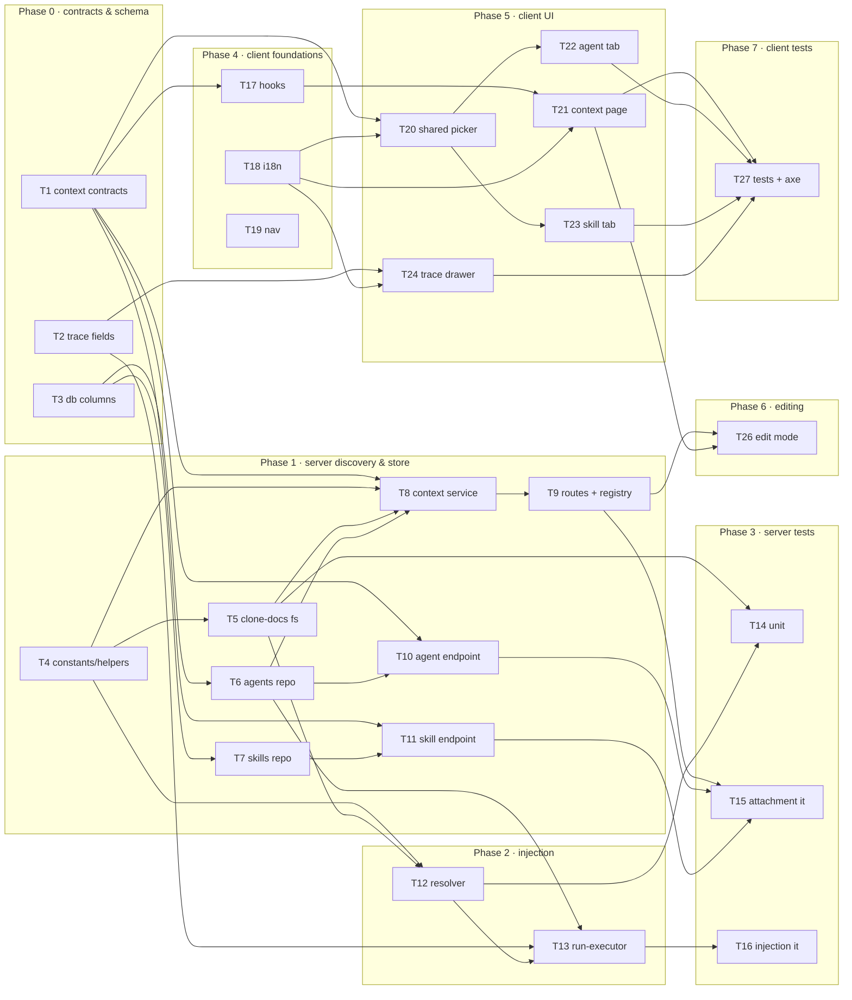

# Implementation Plan: Project Context

## Overview

Discover every Markdown document in a repository's clone working tree, let a user attach/detach/reorder
them on an Agent and on a Skill, resolve the deduplicated union (agent-first, then enabled linked
skills) at run time, read each document fresh, and inject it into `reviewer-core`'s already-built but
never-populated `specs` prompt slot as untrusted content. The run trace records what was read, what was
missing, and what was truncated, and the trace drawer renders the exact injected text.

Source: `specs/cross-module/SPEC-01-project-context.md` (status: approved, 44 ACs).

## Execution mode

**multi-agent (parallel)** — assumed default, **confirm**. `AskUserQuestion` is unavailable inside this
agent, so the mode could not be asked. This feature splits cleanly along four independent seams (server
discovery module, attachment store, run-executor wiring, three client surfaces), which is exactly the
shape parallel execution pays off on — so the plan is written for it: contracts and DB schema land first
in Phase 0, then every concurrent task carries strictly non-overlapping `Owned paths` and an explicit
`Depends-on`. If single-agent is preferred instead, the same task order works top-to-bottom unchanged;
only the `Owned paths` non-overlap constraint becomes irrelevant.

## Requirements (verified)

Restated from `SPEC-01`, grouped to its own AC numbering. Every AC is cited by at least one task in the
traceability table at the end of this plan.

- **R1 (AC-1 – AC-5): Discovery.** Walk the repo clone working tree for `.md`; prune dot-directories,
  `node_modules`, and build-output/vendor dirs; report repo-relative forward-slash paths with no
  leading `./`; carry a `bucket` = top-level directory name or literal `root`, as an **open set** the UI
  renders with a distinguishable tag rather than discarding.
- **R2 (AC-6 – AC-8): Token estimates.** Per-document `estimated_tokens = ceil(size_bytes / 4)`, an
  aggregate `estimated_tokens_total`, and every token figure in the UI prefixed `≈` and never presented
  as an exact tokenizer count.
- **R3 (AC-9 – AC-11): Preview and usage.** Render a selected document's full Markdown; fail soft with a
  named read-failure message on non-UTF-8/unreadable content while the listing stays usable; report
  `used_by_agents` = count of workspace agents with that exact path directly attached.
- **R4 (AC-12 – AC-16): Agent attachment.** Persist the complete ordered path list as a whole-list
  replace; persist **paths only**, never document text or size; order determines position in the
  assembled `## Project context`; the change must **not** bump `agents.version` nor add an
  `agent_versions` row; the tab shows "N of M attached", the attached-token sum, and the two verbatim
  strings from AC-16.
- **R5 (AC-17 – AC-21): Skill attachment and inheritance.** Same whole-list replace semantics on a
  skill, no `version` bump; tab shows the count, token sum, the verbatim inheritance hint, and a
  `## Project specifications` serialization preview; run-time resolution is `dedupe(agent paths, then
  each **enabled** linked skill's paths in skill load order)` with first occurrence fixing position;
  disabled skills contribute nothing while staying linked.
- **R6 (AC-22 – AC-24): Run-time injection.** Read each resolved document fresh from the repo at run
  time (never a copy captured at attach time); pass full text in resolved order into the existing
  `specs` slot so `## Project context` lands between `## Repo skeleton` and `## Callers of changed
  symbols`; in-place edits write to the local working tree only, never commit or push, with a
  resync-discards-edits warning in the UI.
- **R7 (AC-25 – AC-27): Fail-soft.** An unreadable, renamed, deleted, or root-escaping document is
  skipped and recorded, and the run completes; an empty or wholly-missing resolved set omits the block
  entirely and leaves `prompt_assembly.specs` null, byte-identical to the no-attachment baseline; the
  trace records the ordered read list and the ordered skipped list separately.
- **R8 (AC-28 – AC-31): Prompt Assembly view.** Row labelled "Project context — attached specs
  (untrusted)"; expanding shows the exact persisted injected text including `<untrusted source="spec-N">`
  delimiters, untruncated, never re-read from disk; the row offers copy-to-clipboard and an `≈N tok`
  estimate like every other row; the Configuration panel lists read paths and, separately under a
  visually-distinguished label, skipped paths, with "none" fallbacks.
- **R9 (AC-32, AC-33): Untrusted handling.** One `wrapUntrusted` wrapper per document via
  `reviewer-core`'s existing mechanism, no alternative wrapping or sanitisation; an embedded
  `</untrusted>` is neutralised so a document cannot escape its wrapper.
- **R10 (AC-34 – AC-36): Degraded and empty states.** No clone → successful empty listing with
  `clone_available: false` and a "not cloned yet" page state, never an error; no `.md` → empty state
  whose copy names the real discovery scope (the stale `.devdigest/specs/` wording **must** be
  corrected); an attached path absent from discovery stays visible, flagged missing, and detachable.
- **R11 (AC-37 – AC-39): Interaction safety.** Any read/write/attachment path resolving outside the
  clone root via `..`, an absolute path, or a symlink is rejected with no filesystem access; overlapping
  attachment saves apply as whole-list replacements with last-write-wins and never a conflict or
  constraint error; the tab disables toggles and reorder controls while a save is in flight.
- **R12 (AC-40): Navigation.** A "Project Context" entry in the repository-scoped nav section, scoped to
  the active repository.
- **R13 (AC-41 – AC-44): Non-functional.** Listing < 2,000 ms p95 at ≤ 20,000 files / ≤ 500 documents;
  64 KiB per-document injection cap with an explicit truncation marker and a read-and-truncated record;
  256 KiB total injection cap with in-order omission and a recorded omitted list; WCAG 2.1 AA on the new
  page and both tabs, with reorder fully keyboard-operable.
- **R14 (Non-goal, enforced): `reviewer-core` is not modified.** Its `specs` slot, `wrapUntrusted`,
  `INJECTION_GUARD`, and section ordering are consumed exactly as shipped. Indexing/chunking/embedding,
  the `IndexStatus` contract, the `context/reindex` stub, retrieval/ranking, non-`.md` formats,
  per-document access control, and the Evals/Stats/Versions/CI/Memory tabs are all out of scope.

**Resting on an unconfirmed default — confirm before the affected task starts:**

- **R13/AC-42 truncation record** → plan adds a `specs_truncated` trace field (T2, T13, T24). See
  Rec-1.
- **R6/AC-24 in-place editing** → plan builds it, isolated in Phase 6 so it can be dropped. See Q-2.
- Nav icon/shortcut for AC-40 → `FileText` + `gKey: "d"` (T19). No AC constrains either; `p`/`a`/`s`/`c`
  and `,` are already taken in `client/src/vendor/ui/nav.ts`.
- Listing freshness → walk per request, no cache; `summary.refreshed_at` is the walk timestamp. AC-41's
  2,000 ms p95 budget makes an uncached walk viable and no AC mandates caching.

## Open questions & recommendations

`AskUserQuestion` is not available to this agent, so these were not asked. None blocks starting Phase 0;
each is flagged on the task it affects.

### Gaps I found in the spec (not in its own Open questions)

- **Q-1 — AC-42 has no contract field to record "read-and-truncated".** `specs_read` holds read paths and
  the contract scopes `specs_missing` to "missing, unreadable, or omitted for budget". A truncated
  document *was* read, so it belongs in neither, and AC-42's "shall record the document as
  read-and-truncated" has nowhere to land except the in-prompt marker — which AC-31's
  "visually-distinguished" Configuration panel cannot surface.
  → **default: add an optional `specs_truncated: string[]`** to `trace.ts` beside `specs_missing` and
  render it as a third labelled list (T2, T13, T24). Additive and optional, so historical traces are
  unaffected. Alternative, if a third field is unwanted: marker-only, path stays in `specs_read`, and
  AC-42's record requirement is satisfied only inside the prompt text.
- **Q-2 — AC-24 is written conditionally but Resolved decisions say editing is in scope.** "WHERE
  in-place document editing is offered…" is vacuously satisfiable by not offering editing, which
  contradicts the Resolved decision and leaves the pre-written `context.json` editor copy unused.
  → **default: build it**, confined to Phase 6 (T26 + the write half of T8/T9) so it can be cut without
  touching any other task.
- **Q-3 — AC-42's truncation marker has no specified literal.** No AC or contract fixes the string.
  → **default:** a single-line marker constant in `server/src/modules/context/constants.ts`, asserted by
  name in tests rather than by literal text, so changing the wording is not a test break.
- **Q-4 — AC-16's "N of M attached" is undefined when a path is attached but undiscovered (AC-36).**
  Is a missing attached path counted in N? Is it counted in M?
  → **default:** N counts every persisted attached path including missing ones (so the pill agrees with
  the visible list); M counts discovered documents only. With 2 attached of which 1 is missing, and 7
  discovered, the pill reads "2 of 7 attached".
- **Q-5 — AC-11's `used_by_agents` scope is unstated across repositories.** Attachments are
  workspace-scoped (on the agent row) while documents are discovered per repository, so the same path
  attached in repo A counts toward repo B's listing.
  → **default:** count by exact path string across the workspace, matching the contract's wording
  literally. This is the listing-side face of the spec's own second Open question.

### Recommendations

- **Rec-1 — keep the clone walk inside the new `context` module; do not extend `GitClient`.**
  `GitClient.readFile` (`server/src/adapters/git/simple-git.ts:129-131`) is a bare
  `join(clonePathFor(repo), path)` with **no confinement**, so it is unsafe for the client-supplied paths
  AC-37 governs and must not be reused for them. The alternative — adding `walkMarkdown`/`readFileSafe`/
  `writeFile` to `GitClient` in `server/src/vendor/shared/adapters.ts` — would edit an existing shared
  contract consumed by all packages, force a matching `server/src/adapters/mocks.ts` change, and create a
  serialization point three client tasks would wait on. The barrel's own header says feature agents
  *extend* contracts rather than edit them. Recommended instead: a `clone-docs.ts` infrastructure file in
  the new module that takes the clone root from `container.git.clonePathFor(ref)` and does its own
  `node:fs` walk plus `realpath`-confined read/write. Shared `adapters.ts` and `mocks.ts` stay untouched.
- **Rec-2 — model attachments as one jsonb column per row, never a junction table.** This is what makes
  AC-38 free rather than hard. `server/INSIGHTS.md` (2026-09-21) records `agent_skills`' whole-set
  replacement producing `duplicate key value violates unique constraint
  "agent_skills_agent_id_skill_id_pk"` 500s on rapid toggles, because the Skills tab sends the entire
  desired list on every toggle — *exactly* the UI pattern AC-12/AC-17 repeat. A single
  `UPDATE … SET context_documents = $1` is atomic by construction: overlapping saves cannot interleave
  into a partial or duplicated list, so last-write-wins falls out of the storage choice instead of
  needing transaction gymnastics. The spec already picks this shape (`skills.evidenceFiles`,
  `server/src/db/schema/skills.ts:19`, as precedent) — this recommendation is to treat it as
  **load-bearing for AC-38** and reject any later "normalise it into a join table" refactor without
  re-solving the race.
- **Rec-3 — route attachment writes through a dedicated endpoint, never the existing `PUT /agents/:id`.**
  `AgentsService.update` (`server/src/modules/agents/service.ts:99`) bumps `version` and writes an
  `agent_versions` row; reusing it would violate AC-15/AC-17 directly. A separate
  `POST /agents/:id/context-documents` (and the skill twin) keeps the no-version-bump guarantee
  structural rather than a behaviour an implementer has to remember.
- **Rec-4 — promote the attachment picker to a shared client component, not two copies.** The agent tab
  (AC-16) and skill tab (AC-18, AC-19) need the same filter box, toggle list, bucket tags,
  keyboard-operable reorder (AC-44), in-flight disabling (AC-39), and missing-path flagging (AC-36). Two
  real consumers is the `frontend-architecture` bar for promotion, so build it once in
  `client/src/components/context-attachments/` (T20) and let both tabs wrap it with their own
  copy/footer. Building it twice guarantees the two tabs' AC-39 and AC-44 behaviour drift apart.
- **Rec-5 — do not touch `SpecFile` or `IndexStatus`.** Both are contract-only and unused by any live
  endpoint. `SpecFile` is weaker than this feature needs (all-optional fields, no `bucket`,
  `estimated_tokens`, or `used_by_agents`) and `IndexStatus` belongs to the out-of-scope indexing
  concern. Add a new `contracts/context.ts` rather than widening either; leave them in place so nothing
  outside this feature breaks. Same for the `POST /repos/:repoId/context/reindex` stub hook — delete the
  client stub (T17), implement no server route.
- **Rec-6 — follow-ups, explicitly out of this plan.** The spec's five remaining Open questions (two
  divergent token estimators; cross-repo attachment resolution; direct-vs-inherited `used_by_agents`;
  filter box match semantics; whether the PR brief/intent pipeline also consumes documents) each already
  have a written default behaviour in the ACs, so none blocks implementation. They are low-risk
  follow-ups: the first three are observable-but-tolerable inconsistencies, the fourth is an unspecified
  detail T20 will have to pick a default for (**default: case-insensitive substring match on path only;
  attached-but-filtered-out documents stay visible so a filter can never hide an attachment the user is
  about to replace**), and the fifth is a non-goal this plan honours by wiring injection into agent runs
  only.

## Affected modules & contracts

- **server** — new `modules/context/` (discovery, confined read/write, run-time resolution); additive
  jsonb column on `agents` + `skills` with one migration; new attachment endpoints on `agents` and
  `skills`; `reviews/run-executor.ts` populates the three slots that currently hardcode `specs: null` /
  `specs_read: []` (lines 341, 486, 490).
- **client** — new `/repos/[repoId]/context` page; new shared attachment-picker component; a `context`
  tab on both the Agent and Skill editors; trace-drawer label + missing/truncated lists; one nav entry;
  new hooks file replacing the `core.ts:122-137` stubs; four message catalogues.
- **reviewer-core** — **no change.** `PromptParts.specs?: string[]` (`reviewer-core/src/prompt.ts:47`),
  the per-document `wrapUntrusted('spec-N', …)` block and `## Project context` section (lines 101-104,
  121), the section ordering (line 118-130), `specs: specsBlock ?? null` (line 143), and
  `wrapUntrusted`'s `</untrusted>` escaping (lines 30-34) are all consumed as shipped. Any task that
  edits a file under `reviewer-core/` has gone wrong.
- **e2e** — no change.
- **Contracts:**
  - **New file:** `server/src/vendor/shared/contracts/context.ts` — `ContextDocument`,
    `ContextListing`, `ContextDocumentContent`, `ContextDocumentWrite`, `ContextAttachmentSet`.
    Plus one export line in `server/src/vendor/shared/index.ts`.
  - **Edit to an existing shared contract — explicit callout:**
    `server/src/vendor/shared/contracts/trace.ts` gains `specs_missing` and (per Q-1)
    `specs_truncated`, both `z.array(z.string()).optional()`. Both are **additive and optional**, so
    already-persisted traces keep parsing and the client renders "none" for an absent field — but the
    file is consumed by all packages, so this is the one shared-contract edit in the plan and it must
    stay additive. Widening `specs_read`, renaming anything, or making either field required is out of
    bounds.

## Architecture changes

Onion layering for the new server module, per `onion-architecture`:

- `server/src/modules/context/routes.ts` — **Presentation.** Fastify only. Zod params/body/response via
  `fastify-type-provider-zod`, `getContext` for tenancy, one service call per handler. Must not import
  `drizzle-orm` or `db/schema.js`. (The existing `pulls`/`polling`/`settings`/`workspace` route files
  call `container.db` directly — that is the anti-pattern here, not the template.)
- `server/src/modules/context/service.ts` — **Application.** Orchestrates listing (walk → enrich with
  `used_by_agents`), content reads, and the working-tree write. Reaches the clone through
  `container.git.clonePathFor` and cross-module attachment counts through `container.agentsRepo` — never
  by importing another module's `repository.ts`. No Fastify types.
- `server/src/modules/context/clone-docs.ts` — **Infrastructure.** The only file doing `node:fs`. Walk,
  `stat`, `realpath`-confined read, confined write. No Drizzle, no Fastify, no DTO knowledge.
- `server/src/modules/context/resolver.ts` — **Application.** Pure-ish resolution + budgeting. Takes the
  two path lists and a reader function; returns `{ specs, read, missing, truncated }`. Dependency-injected
  reader keeps it unit-testable with no filesystem.
- `server/src/modules/context/constants.ts`, `helpers.ts` — module-local constants and pure functions
  (`bucketFor`, `estimateTokens`, `toPosixRelative`). No I/O.
- Attachment persistence stays in the **owning** module's repository
  (`agents/repository.ts`, `skills/repository.ts`) and is exposed cross-module via the already-registered
  `container.agentsRepo` getter (`server/src/platform/container.ts:111`). No new container getter is
  needed; a `skillsRepo` getter is **not** added — the skill-side read the resolver needs comes through
  `AgentsRepository.linkedSkills` (`server/src/modules/agents/repository.ts:192`), which already joins
  `skills` and will carry the new column on its returned row.

Client boundaries, per `frontend-architecture` and `next-best-practices`:

- `client/src/app/repos/[repoId]/context/page.tsx` — `"use client"`, matching the
  `/repos/[repoId]/conventions/page.tsx` precedent (it needs `useParams`, `useActiveRepo`, and mutations).
  Route-local components under `_components/`; route-level constants/helpers/styles one level up beside
  `page.tsx`.
- `client/src/components/context-attachments/` — the one shared component, promoted because two
  unrelated features (agent editor, skill editor) consume it (Rec-4).
- All server communication through hooks in `client/src/lib/hooks/context.ts` backed by
  `client/src/lib/api.ts`; no raw fetch in a component body. Every string through
  `useTranslations` — no hardcoded copy.

## Phased tasks

### Phase 0 — Contracts & schema (serialization point; everything downstream depends on it)

T1, T2, T3 touch disjoint files and may run fully concurrently.

- **T1 — New shared context contracts**
  - **Action:** Create `server/src/vendor/shared/contracts/context.ts` with the five Zod schemas from
    the spec's Contracts section, each with its inferred type exported alongside it
    (`type-export-schemas-and-types`): `ContextDocument` (`path`, `bucket`, `size_bytes`,
    `estimated_tokens`, `updated_at`, `used_by_agents` — **all required**, per the spec's deliberate
    strengthening over `SpecFile`); `ContextListing` (`documents: ContextDocument[]`, `summary:
    { document_count, estimated_tokens_total, refreshed_at, clone_available }`);
    `ContextDocumentContent` (`path`, `content`, `size_bytes`, `estimated_tokens`, `updated_at`);
    `ContextDocumentWrite` (`path`, `content`); `ContextAttachmentSet` (`paths: z.array(z.string())`,
    possibly empty — replace-all, not patch). Add one `export * from './contracts/context.js';` line to
    `server/src/vendor/shared/index.ts`. Do **not** touch `SpecFile` or `IndexStatus` in
    `platform.ts` (Rec-5).
  - **Module:** server · **Type:** backend
  - **Skills to use:** `zod`, `typescript-expert`, `onion-architecture` (boundary-DTO rules)
  - **Owned paths:** `server/src/vendor/shared/contracts/context.ts`,
    `server/src/vendor/shared/index.ts`
  - **Depends-on:** none
  - **Risk:** low
  - **Known gotchas:** ESM — relative imports carry the `.js` extension, including the new barrel line.
    Keep every field required rather than `.nullish()`: `SpecFile`'s all-optional shape is exactly the
    weakness the spec supersedes, and optional fields here would push null-handling into three client
    surfaces.
  - **Acceptance:** `cd server && pnpm typecheck` passes; `pnpm exec vitest run contracts.test` passes;
    `import { ContextListing } from '@devdigest/shared'` resolves from both `server/` and `client/`
    (prove with the `cd client && pnpm typecheck` run in T17).

- **T2 — Trace contract: `specs_missing` + `specs_truncated`**
  - **Action:** In `server/src/vendor/shared/contracts/trace.ts`, add `specs_missing:
    z.array(z.string()).optional()` and `specs_truncated: z.array(z.string()).optional()` to `RunTrace`
    beside the existing `specs_read` (line 87). Leave `PromptAssembly.specs` (line 43) exactly as is —
    this feature populates it, it does not reshape it. Both new fields optional for backward
    compatibility with already-persisted traces (contract requirement; AC-31 renders "none" when absent).
  - **Module:** server · **Type:** backend
  - **Skills to use:** `zod`, `typescript-expert`
  - **Owned paths:** `server/src/vendor/shared/contracts/trace.ts`
  - **Depends-on:** none
  - **Risk:** medium — **the plan's only edit to an existing shared contract.** Additive and optional, so
    non-breaking by construction; call it out in the PR description. `specs_truncated` rests on Q-1 —
    confirm before merging, though adding it costs nothing if the answer later changes.
  - **Known gotchas:** `RunTrace` is constructed in two places in `run-executor.ts` (the full trace at
    ~line 320 and `traceFromBuffer` at ~line 486) and consumed by `TraceBody.tsx`. Optional fields mean
    neither *must* change, which is precisely why T13 and T24 must be checked for actually populating and
    rendering them rather than silently inheriting `undefined`.
  - **Acceptance:** `cd server && pnpm typecheck` passes; `pnpm exec vitest run contracts.test` passes;
    a fixture `RunTrace` object with neither new field still parses (assert explicitly — this is the
    backward-compatibility guarantee).

- **T3 — DB schema: `context_documents` on `agents` and `skills`**
  - **Action:** Add `contextDocuments: jsonb('context_documents').$type<string[]>()` to
    `server/src/db/schema/agents.ts` (`agents` table) and `server/src/db/schema/skills.ts` (`skills`
    table), mirroring the existing `evidenceFiles` column shape at `server/src/db/schema/skills.ts:19`
    (Rec-2). Nullable, no default — treat `null` as empty in the read path, exactly as `evidenceFiles`
    already is. Generate the migration with `cd server && pnpm db:generate` and apply with
    `pnpm db:migrate`. Re-export the row types from `server/src/db/rows.ts` if `AgentRow`/`SkillRow` are
    declared there rather than inferred in place.
  - **Module:** server · **Type:** backend
  - **Skills to use:** `drizzle-orm-patterns`, `postgresql-table-design`, `onion-architecture`
  - **Owned paths:** `server/src/db/schema/agents.ts`, `server/src/db/schema/skills.ts`,
    `server/src/db/migrations/**` (the one newly generated file), `server/src/db/rows.ts`
  - **Depends-on:** none
  - **Risk:** medium — a migration, and the one task that cannot be trivially reverted.
  - **Known gotchas:** From `server/INSIGHTS.md` (2026-09-22): `pnpm db:generate` **hangs forever on a
    TTY rename-vs-create prompt** when one schema edit both adds and drops columns, and piping answers to
    it does not work. This edit is a **pure addition across two tables**, which generates cleanly — so do
    not combine it with any column removal or rename in the same `db:generate` run. Do **not** add a
    `NOT NULL DEFAULT '[]'` here: a volatile-default `NOT NULL` add rewrites the table, and nullable
    matches the `evidenceFiles` precedent the service layer already knows how to read. **Never
    `docker compose down -v`** while iterating — it wipes the `devdigest_pgdata` volume and every
    imported repo; use `./scripts/e2e.sh` for a disposable stack.
  - **Acceptance:** exactly one new file appears under `server/src/db/migrations/`;
    `cd server && pnpm db:migrate` applies cleanly against a fresh DB; `pnpm typecheck` passes;
    `psql -c '\d agents'` and `'\d skills'` both show a nullable `context_documents jsonb` column.

### Phase 1 — Server: discovery, confinement, and the attachment store

T4 is a prerequisite for T5/T8. T6 and T7 are independent of each other and of T4/T5.

- **T4 — Context module constants & pure helpers**
  - **Action:** Create `server/src/modules/context/constants.ts` — `MARKDOWN_EXT = '.md'`; a
    `CONTEXT_EXCLUDED_DIRS` list seeded from `server/src/modules/repo-intel/constants.ts`'s
    `EXCLUDED_DIRS` (`node_modules`, `dist`, `build`, `coverage`, `.next`, `out`, `vendor`, `.git`) and
    extended with a general dot-directory rule so `.devdigest` and any other dot-dir are pruned (AC-2);
    `MAX_DOC_BYTES = 64 * 1024` (AC-42); `MAX_TOTAL_BYTES = 256 * 1024` (AC-43); `TRUNCATION_MARKER`
    (Q-3); `ROOT_BUCKET = 'root'` (AC-4). Create `helpers.ts` with pure functions:
    `toPosixRelative(root, abs)` (forward slashes, no leading `./` or `/` — AC-3), `bucketFor(relPath)`
    (first segment, or `ROOT_BUCKET` — AC-4, open set, no enum), `estimateTokens(sizeBytes)` =
    `Math.ceil(sizeBytes / 4)` (AC-6). No I/O, no Fastify, no Drizzle.
  - **Module:** server · **Type:** backend
  - **Skills to use:** `typescript-expert`, `onion-architecture`
  - **Owned paths:** `server/src/modules/context/constants.ts`,
    `server/src/modules/context/helpers.ts`
  - **Depends-on:** none
  - **Risk:** low
  - **Known gotchas:** Do not `import` `repo-intel`'s `EXCLUDED_DIRS` — copy the values into this
    module's own constant. That list is annotated `[T1]/[T2]/[T3]` for the *indexer's* walk scope and
    will evolve on the indexer's schedule, not this feature's; a cross-module import would couple two
    unrelated roadmaps. `bucketFor` must not normalise case or map unknown names — AC-5 requires an
    arbitrary directory name to survive to the UI intact.
  - **Acceptance:** new `server/test/context-helpers.test.ts` asserts the spec's own observables —
    `specs/public-api.md → 'specs'`, `docs/b.md → 'docs'`, `adr/0001-foo.md → 'adr'`,
    `README.md → 'root'`; a 1,000-byte document → 250 tokens; `./specs/a.md` and `/specs/a.md` both
    normalise to `specs/a.md`. `cd server && pnpm exec vitest run context-helpers` passes.

- **T5 — Clone-docs infrastructure: walk + confined read/write**
  - **Action:** Create `server/src/modules/context/clone-docs.ts` — the **only** file in this feature
    doing `node:fs`. Export: `walkMarkdown(cloneRoot)` → `{ path, size_bytes, updated_at }[]`, an
    iterative (not recursive — see gotchas) depth-first walk that **prunes** excluded and dot-directories
    without descending (AC-2) and never follows directory symlinks out of the tree;
    `resolveConfined(cloneRoot, relPath)` → absolute path or `null`, using `path.resolve` plus
    `fs.realpath` on the resolved target **and** on its parent directory, rejecting anything whose
    realpath is not inside `realpath(cloneRoot)` (AC-37 — covers `..`, absolute paths, and symlinks);
    `readDocument(cloneRoot, relPath)` → UTF-8 string, throwing a typed error on confinement failure or
    unreadable/non-UTF-8 content; `writeDocument(cloneRoot, relPath, content)` → confined whole-file
    write (AC-24); `cloneAvailable(cloneRoot)` → boolean (AC-34). No Drizzle, no Fastify, no DTOs.
  - **Module:** server · **Type:** backend
  - **Skills to use:** `security` (path traversal, symlink confinement, A05/A01),
    `typescript-expert`, `onion-architecture`
  - **Owned paths:** `server/src/modules/context/clone-docs.ts`
  - **Depends-on:** T4
  - **Risk:** high — this is the file AC-37 lives or dies on, and the only attacker-reachable filesystem
    surface in the feature.
  - **Known gotchas:** `GitClient.readFile` (`server/src/adapters/git/simple-git.ts:129-131`) is a bare
    `join(clonePathFor(repo), path)` with **no confinement** — do not reuse it for any client-supplied
    path (Rec-1); it is safe only for the server's own hardcoded paths, which is all the Conventions
    Extractor uses it for. A prefix-string check on the *unresolved* path is not sufficient: resolve
    first, then `realpath`, then compare — a symlink inside the clone pointing at `/etc/passwd` passes a
    naive prefix test. Also `realpath` on a path that does not exist throws, so the write path must
    confine the **parent directory** and the final segment separately. Prefer an iterative stack walk
    over recursion: a deep or symlink-looped tree can blow the stack, and AC-41's 20,000-file budget
    makes the walk hot enough that per-entry `Promise.all` fan-out is the wrong shape — use
    `readdir(dir, { withFileTypes: true })` and batch `stat` calls (`Promise.allSettled` in bounded
    batches, mirroring the batching lesson in `server/INSIGHTS.md`), so one unreadable entry cannot
    reject the whole walk.
  - **Acceptance:** new `server/test/context-clone-docs.test.ts` against a temp-dir fixture asserts: a
    `.md` under `node_modules/`, `.git/`, `dist/`, and `.devdigest/` is **never** returned (AC-2); nested
    and root `.md` files are both found with correct relative paths (AC-1, AC-3); `resolveConfined`
    returns `null` for `../../../../etc/passwd`, for `/etc/passwd`, and for a symlink pointing outside
    the fixture root, and **no read occurs** in any of those cases (AC-37); `cloneAvailable` is `false`
    for a non-existent directory (AC-34); a binary file named `*.md` makes `readDocument` throw a typed
    error while `walkMarkdown` still lists it (AC-10). `cd server && pnpm exec vitest run
    context-clone-docs` passes.

- **T6 — Agents repository + attachment counts**
  - **Action:** In `server/src/modules/agents/repository.ts`, add three Drizzle-only methods:
    `contextDocumentsFor(agentId)` → `string[]` (coalescing `null` → `[]`);
    `setContextDocuments(agentId, paths)` → a **single** `UPDATE agents SET context_documents = $1 WHERE
    id = $2` (Rec-2 — one atomic statement, no transaction, no delete-then-insert), which must **not**
    touch `version` and must **not** write an `agent_versions` row (AC-15); and
    `countAgentsByContextPath(workspaceId)` → `Map<string, number>` for the listing's `used_by_agents`
    (AC-11), workspace-scoped. Confirm `linkedSkills` (line 192) selects `t.skills` wholesale so the new
    column rides along on its returned row for free — if it projects individual columns instead, add
    `contextDocuments` to the projection. No business rules here; no `@devdigest/shared` imports.
  - **Module:** server · **Type:** backend
  - **Skills to use:** `drizzle-orm-patterns`, `onion-architecture`, `postgresql-table-design`
  - **Owned paths:** `server/src/modules/agents/repository.ts`
  - **Depends-on:** T3
  - **Risk:** medium
  - **Known gotchas:** Do **not** copy `setSkills`' shape (`server/src/modules/agents/repository.ts:229-248`).
    Its loop-upsert-then-delete-the-complement pattern exists only because `agent_skills` is a junction
    table, and even in its current transactional form it is the direct descendant of the duplicate-key
    race in `server/INSIGHTS.md` (2026-09-21). A jsonb column needs exactly one `UPDATE`; adding a
    transaction or a read-modify-write around it would *reintroduce* the lost-update window AC-38
    forbids. `countAgentsByContextPath` must scope to `workspaceId` — an unscoped count is a
    cross-tenant leak (A01).
  - **Acceptance:** `cd server && pnpm typecheck` passes; covered end-to-end by T15's integration
    tests (including the AC-38 concurrency case).

- **T7 — Skills repository attachment methods**
  - **Action:** In `server/src/modules/skills/repository.ts`, add `contextDocumentsFor(skillId)` and
    `setContextDocuments(skillId, paths)` with the same single-`UPDATE` shape and the same
    no-`version`-bump / no-`skill_versions`-row guarantee (AC-17).
  - **Module:** server · **Type:** backend
  - **Skills to use:** `drizzle-orm-patterns`, `onion-architecture`
  - **Owned paths:** `server/src/modules/skills/repository.ts`
  - **Depends-on:** T3
  - **Risk:** low
  - **Known gotchas:** Same single-`UPDATE` rule as T6. `evidenceFiles` on the same table is the shape
    precedent — read it to match the existing `null`-coalescing convention rather than inventing a second
    one.
  - **Acceptance:** `cd server && pnpm typecheck` passes; covered by T15.

- **T8 — Context service (listing, content, write)**
  - **Action:** Create `server/src/modules/context/service.ts` — a `ContextService` whose constructor
    takes the `Container` (matching `RepoIntelService`/`ReviewService`). Methods: `list(workspaceId,
    repoId)` → `ContextListing` — resolve the repo via `container.reposRepo`, derive the clone root via
    `container.git.clonePathFor(ref)`, return `{ documents: [], summary: { …, clone_available: false } }`
    when the clone is absent (**AC-34 — a successful empty response, never a throw**), otherwise walk via
    T5, map each entry through `bucketFor`/`estimateTokens`, enrich with `used_by_agents` from
    `container.agentsRepo.countAgentsByContextPath(workspaceId)`, and compute the summary with
    `estimated_tokens_total` as the sum (AC-7) and `refreshed_at` as the walk timestamp;
    `getDocument(workspaceId, repoId, path)` → `ContextDocumentContent`, rejecting an unconfined path
    with a `ValidationError` (AC-37) and surfacing an unreadable document as a typed read failure
    (AC-10); `writeDocument(workspaceId, repoId, path, content)` → working-tree-only write via T5, no
    git commit, no push (AC-24). Sort `documents` deterministically by path so the listing is stable
    across requests.
  - **Module:** server · **Type:** backend
  - **Skills to use:** `onion-architecture`, `typescript-expert`, `security`, `zod`
  - **Owned paths:** `server/src/modules/context/service.ts`
  - **Depends-on:** T1, T4, T5, T6
  - **Risk:** medium
  - **Known gotchas:** Must not import `fastify`, `fastify-type-provider-zod`, or `FastifyRequest`/`Reply`
    (onion rule). Cross-module reads go through `container.agentsRepo` — never by importing
    `modules/agents/repository.ts` directly. The clone root comes from `container.git.clonePathFor`
    (`server/src/adapters/git/simple-git.ts:37-39`, `<cloneDir>/<owner>/<repo>`), so a repo whose owner
    or name is missing from the row must degrade to `clone_available: false`, not throw. `server/clones/**`
    is git-ignored runtime data — never commit a fixture into it.
  - **Acceptance:** covered by T15's integration tests; `cd server && pnpm typecheck` passes;
    `grep -nE "^import .*(fastify|drizzle-orm|db/schema)" server/src/modules/context/service.ts` returns
    nothing.

- **T9 — Context routes + module registration**
  - **Action:** Create `server/src/modules/context/routes.ts` as a default-exported Fastify plugin:
    `GET /repos/:repoId/context` → `ContextListing`; `GET /repos/:repoId/context/document?path=…` →
    `ContextDocumentContent`; `PUT /repos/:repoId/context/document` with a `ContextDocumentWrite` body
    (Phase-6 consumer; the route ships here so the server surface is complete in one place). Declare
    params/query/body/response schemas via `fastify-type-provider-zod` against the T1 contracts, resolve
    tenancy with `getContext(app.container, req)`, and call exactly one service method per handler. Add
    one import line and one registry entry (`context`) to `server/src/modules/index.ts`. Do **not**
    implement `POST /repos/:repoId/context/reindex` — explicit non-goal (Rec-5).
  - **Module:** server · **Type:** backend
  - **Skills to use:** `fastify-best-practices`, `onion-architecture`, `zod`, `security`
  - **Owned paths:** `server/src/modules/context/routes.ts`, `server/src/modules/index.ts`
  - **Depends-on:** T8
  - **Risk:** low
  - **Known gotchas:** Modules are registered **statically** in `server/src/modules/index.ts` — there is
    no filesystem autoload, so a new module that is not added to that record is silently never mounted.
    From `server/INSIGHTS.md` (2026-09-22): zod `.default({})` on a route body only substitutes for
    `undefined`, not the `null` a bodyless `app.inject` sends — so T15 must pass `payload: {}`
    explicitly rather than relying on a default. Must not import `drizzle-orm` or `../../db/schema.js`
    in this file. Confinement rejection must surface as a 4xx client error, never a 500 (AC-37).
  - **Acceptance:** `cd server && pnpm exec vitest run routes-smoke` passes with the three new routes
    mounted; `GET /repos/<uncloned-repo>/context` returns **200** with
    `summary.clone_available === false` and zero documents (AC-34); `GET
    /repos/:repoId/context/document?path=../../../../etc/passwd` returns a 4xx (AC-37).

- **T10 — Agent attachment endpoint**
  - **Action:** Add `GET /agents/:id/context-documents` and `POST /agents/:id/context-documents` to
    `server/src/modules/agents/routes.ts` (body: `ContextAttachmentSet`, response: the echoed persisted
    `paths` — AC-12), plus the matching `AgentsService` methods delegating to T6's repository methods.
    Validate that each submitted path is a plausible repo-relative path and reject absolute paths or
    `..` segments at the boundary (AC-37 — attachment requests are named explicitly in that AC, so
    rejection happens here even though nothing is read). Workspace-scope the agent lookup and 404 an
    agent outside the caller's workspace, matching the sibling handlers. **Do not** route this through
    `AgentsService.update` (Rec-3).
  - **Module:** server · **Type:** backend
  - **Skills to use:** `fastify-best-practices`, `onion-architecture`, `zod`, `security`
  - **Owned paths:** `server/src/modules/agents/routes.ts`, `server/src/modules/agents/service.ts`
  - **Depends-on:** T1, T6
  - **Risk:** medium
  - **Known gotchas:** `AgentsService.update` (`server/src/modules/agents/service.ts:99`) bumps `version`
    and records an `agent_versions` row — AC-15 forbids both for an attachment change, which is exactly
    why this is a separate endpoint. Follow the `POST /agents/:id/skills` handler
    (`server/src/modules/agents/routes.ts:152-165`) for shape, but **not** for storage: that one writes a
    junction table and carries the AC-38 race's history. An empty `paths: []` is a valid request meaning
    "detach everything" — do not reject it or coerce it to a no-op.
  - **Acceptance:** covered by T15, which asserts AC-12 (replace-all round-trip), AC-15 (`version` and
    `agent_versions` length both unchanged), and AC-38 (two concurrent `Promise.all` POSTs both return
    2xx and the persisted list equals exactly one of the two submitted sets).

- **T11 — Skill attachment endpoint**
  - **Action:** Add `GET /skills/:id/context-documents` and `POST /skills/:id/context-documents` to
    `server/src/modules/skills/routes.ts` with the matching `SkillsService` methods over T7, same
    replace-all semantics, same boundary path validation, same no-`version`-bump guarantee (AC-17).
  - **Module:** server · **Type:** backend
  - **Skills to use:** `fastify-best-practices`, `onion-architecture`, `zod`, `security`
  - **Owned paths:** `server/src/modules/skills/routes.ts`, `server/src/modules/skills/service.ts`
  - **Depends-on:** T1, T7
  - **Risk:** low
  - **Known gotchas:** `PUT /skills/:id` (`server/src/modules/skills/routes.ts:83`) versions the body —
    keep attachments off that path entirely (Rec-3).
  - **Acceptance:** covered by T15 — AC-17 asserts a skill at version 5 stays at version 5 with an
    unchanged `skill_versions` row count after an attachment save.

### Phase 2 — Server: resolution and run-executor injection

- **T12 — Resolver: dedupe, fresh read, budgets, fail-soft**
  - **Action:** Create `server/src/modules/context/resolver.ts` exporting `resolveProjectContext({
    agentPaths, skillPathLists, read })` → `{ specs: string[], read: string[], missing: string[],
    truncated: string[] }`. Order: agent's own paths first, then each **enabled** linked skill's paths in
    skill load order, deduplicated so the **first** occurrence fixes position (AC-20, AC-21). For each
    resolved path call the injected `read` function: on success append the text to `specs` and the path
    to `read`; on any failure — missing, unreadable, non-UTF-8, or confinement rejection — skip it and
    append the path to `missing`, never throwing (AC-25). Apply budgets deterministically: a document
    over `MAX_DOC_BYTES` contributes only its first 64 KiB plus `TRUNCATION_MARKER` and its path goes to
    **both** `read` and `truncated` (AC-42); once the cumulative injected size would exceed
    `MAX_TOTAL_BYTES`, omit every remaining document in order and append their paths to `missing`
    (AC-43 — the contract scopes `specs_missing` to include budget omissions). Return
    `specs: []` when nothing was readable, leaving the caller to omit the slot (AC-26). Inject the reader
    as a parameter — no `node:fs`, no container, no Drizzle in this file.
  - **Module:** server · **Type:** backend
  - **Skills to use:** `typescript-expert`, `onion-architecture`
  - **Owned paths:** `server/src/modules/context/resolver.ts`
  - **Depends-on:** T4, T5
  - **Risk:** medium
  - **Known gotchas:** Truncate on **bytes**, not characters — a `String.slice(0, 65536)` on multi-byte
    content yields a different size than the AC's 64 KiB and can split a UTF-8 sequence mid-codepoint;
    slice the `Buffer` and decode with a decoder that tolerates a trailing partial sequence. Dedupe must
    be by exact path string and must preserve first-occurrence position — the spec's observable is
    `agent [B]` + `enabled skill [A, B]` → `[B, A]`, which a naive "concat then `Set`" gets right only
    if the agent list is concatenated first. "Enabled" filtering is the caller's input contract here
    (T13 supplies only enabled skills), but assert it in the unit test so the guarantee is pinned
    somewhere. Do not read documents concurrently in a way that reorders `specs` — resolved order is an
    AC (AC-14, AC-23).
  - **Acceptance:** new `server/test/context-resolver.test.ts` with a stub reader asserts the spec's
    observables: `[B]` + `[A, B]` → `[B, A]` (AC-20); a disabled skill's exclusive document is absent
    (AC-21); a deleted document lands in `missing` and not in `read`, and the call still resolves
    (AC-25); zero readable documents → `specs: []` (AC-26); a 200 KiB document contributes ~64 KiB plus
    the marker and appears in `read` **and** `truncated` (AC-42); documents totalling 400 KiB yield an
    injected total ≤ 256 KiB with the remainder in `missing` (AC-43). `cd server && pnpm exec vitest run
    context-resolver` passes.

- **T13 — Run-executor wiring**
  - **Action:** In `server/src/modules/reviews/run-executor.ts`: resolve project-context documents once
    per agent run, just before the prompt-parts construction at ~line 250, using
    `container.agentsRepo.contextDocumentsFor(agent.id)` for the agent's own paths and the already-computed
    `enabledSkills` (line 231 — `linkedSkills.filter((l) => l.skill.enabled)`) for the skill lists, in
    their existing load order, with a reader bound to this run's repo clone (T5 + T12). Wrap the whole
    resolution in try/catch so **no** project-context failure can fail a run (AC-25, fail-soft NFR).
    Then: add `...(specs.length ? { specs } : {})` to the `PromptParts` object, following the existing
    omit-when-empty spread idiom already used for `callers` (line 252), `repoMap` (254), `skills` (257),
    and `prDescription` (260) — this is what makes AC-26 produce a prompt byte-identical to the
    no-attachment baseline. Replace the hardcoded `specs_read: []` at line 341 with the resolver's
    `read`, and add `specs_missing` and `specs_truncated` from the resolver. Update `traceFromBuffer`
    (lines 486, 490) so the failure/cancel trace carries empty-but-present lists rather than silently
    omitting the new fields.
  - **Module:** server · **Type:** backend
  - **Skills to use:** `onion-architecture`, `typescript-expert`, `security` (untrusted input path)
  - **Owned paths:** `server/src/modules/reviews/run-executor.ts`
  - **Depends-on:** T2, T6, T12
  - **Risk:** high — the integration point, and the one place a regression breaks every existing review
    run.
  - **Known gotchas:** Pass the resolved texts **raw** into `PromptParts.specs`. `reviewer-core`'s
    `assemblePrompt` already calls `wrapUntrusted('spec-N', …)` per entry
    (`reviewer-core/src/prompt.ts:101-104`) and already escapes an embedded `</untrusted>` (lines 30-34)
    — pre-wrapping or pre-sanitising on the server would double-wrap and violate AC-32's "no alternative
    wrapping scheme". Section ordering (`## Repo skeleton` → `## Project context` → `## Callers`, lines
    118-130) is `reviewer-core`'s and satisfies AC-23 for free; do not reorder anything. The spread must
    be conditional: passing `specs: []` instead of omitting the key risks an empty `## Project context`
    heading and breaks AC-26. **Do not edit any file under `reviewer-core/`** — explicit non-goal.
  - **Acceptance:** `cd server && pnpm exec vitest run prompt-structured prompt-callers reviews-helpers`
    still passes (no regression in existing prompt assembly); T16's new tests assert a run with
    attachments has `## Project context` between `## Repo skeleton` and `## Callers of changed symbols`
    in `prompt_assembly.user` (AC-23), a run with no readable documents has `prompt_assembly.specs ===
    null` and no `## Project context` substring (AC-26), and `specs_read` / `specs_missing` /
    `specs_truncated` are populated on the persisted trace (AC-27, AC-42, AC-43).

### Phase 3 — Server tests

T14, T15, T16 are independent of each other.

- **T14 — Discovery, helper, and confinement unit tests**
  - **Action:** Consolidate and extend the test files introduced alongside T4, T5, and T12
    (`server/test/context-helpers.test.ts`, `context-clone-docs.test.ts`, `context-resolver.test.ts`),
    filling any AC left uncovered: AC-1 – AC-7, AC-10, AC-20 – AC-21, AC-25 – AC-26, AC-37, AC-42 –
    AC-43. Build fixture trees in a temp dir; no DB, no Docker — these stay in the hermetic unit lane.
    Add an AC-41 timing assertion against a generated fixture of ~20,000 files / ~500 `.md` documents,
    guarded generously (assert under the 2,000 ms budget, and skip rather than fail on a CI box that
    cannot generate the fixture in reasonable time).
  - **Module:** server · **Type:** backend
  - **Skills to use:** `typescript-expert`, `security`
  - **Owned paths:** `server/test/context-helpers.test.ts`,
    `server/test/context-clone-docs.test.ts`, `server/test/context-resolver.test.ts`,
    `server/test/context-discovery-perf.test.ts`
  - **Depends-on:** T4, T5, T12
  - **Risk:** low
  - **Known gotchas:** Per `TESTING.md`, a test that imports `test/helpers/pg.ts` **must** use the
    `.it.test.ts` suffix — these must **not**, so they stay in the Docker-free unit lane
    (`vitest run --exclude '**/*.it.test.ts'`). Create fixtures under the OS temp dir, never under
    `server/clones/**` (git-ignored runtime data) or the repo tree. A symlink fixture needs a cleanup
    hook that does not follow the link when removing it.
  - **Acceptance:** `cd server && pnpm exec vitest run --exclude '**/*.it.test.ts'` passes with every
    AC above having at least one named test; the perf test reports a duration under 2,000 ms.

- **T15 — Attachment and listing integration tests**
  - **Action:** New `server/test/context.it.test.ts` against a real Postgres via
    `server/test/helpers/pg.ts`, using `app.inject`. Assert: AC-12 replace-all round-trip (save, reopen,
    exact set in exact order); AC-13 the persisted record holds **paths only** — editing a document's
    content changes nothing in it; AC-15/AC-17 `version` and the `agent_versions`/`skill_versions` row
    count are unchanged after an attachment save; **AC-38** two concurrent `Promise.all` POSTs of
    different path sets both return 2xx and the persisted list equals exactly one of the two submitted
    sets — never a merge, a partial list, or empty (this is the direct regression test for the
    `server/INSIGHTS.md` 2026-09-21 failure); AC-34 an uncloned repo yields 200 with
    `clone_available: false`; AC-37 a traversal/absolute/symlink path is rejected 4xx on read, write,
    **and** attachment; AC-11 `used_by_agents` is 2 after attaching to two agents and 1 after detaching
    from one.
  - **Module:** server · **Type:** backend
  - **Skills to use:** `fastify-best-practices` (testing with `inject`), `drizzle-orm-patterns`,
    `security`
  - **Owned paths:** `server/test/context.it.test.ts`
  - **Depends-on:** T9, T10, T11
  - **Risk:** medium
  - **Known gotchas:** From `server/INSIGHTS.md` (2026-09-22): always pass `payload: {}` explicitly to
    `app.inject` for a body schema carrying `.default({})` — a bodyless inject sends `null`, which zod's
    `.default()` does not substitute for, producing a 422 indistinguishable from a real validation
    failure and a test that passes for the wrong reason. The AC-38 test must use two genuinely
    overlapping requests via `Promise.all` (the 2026-09-21 entry notes this reproduced the original bug
    deterministically) — a sequential pair proves nothing. Needs Docker; this file belongs to the
    `server-integration` lane.
  - **Acceptance:** `cd server && pnpm exec vitest run .it.test` passes, including a named AC-38 test
    that fails if the repository method is ever changed to a non-atomic read-modify-write or a junction
    table.

- **T16 — Injection and trace integration tests**
  - **Action:** Extend the review-run test surface (new `server/test/context-injection.it.test.ts`,
    plus additions to the existing structured-prompt unit tests where no DB is needed) to assert AC-22
    (changing a document between two runs changes the text in the second run's
    `prompt_assembly.specs`), AC-23 (section position), AC-26 (`specs: null`, no `## Project context`
    substring, prompt identical to the no-attachment baseline), AC-27 (one entry in each of
    `specs_read` and `specs_missing` for a run with one deleted attachment), AC-32 (each document
    appears exactly once as `<untrusted source="spec-N">…</untrusted>`), and AC-33 (a document
    containing a literal `</untrusted>` produces exactly one closing delimiter per wrapper, with the
    embedded occurrence escaped).
  - **Module:** server · **Type:** backend
  - **Skills to use:** `fastify-best-practices`, `security` (prompt injection), `typescript-expert`
  - **Owned paths:** `server/test/context-injection.it.test.ts`
  - **Depends-on:** T13
  - **Risk:** medium
  - **Known gotchas:** Use the hermetic `MockLLMProvider` from `server/src/adapters/mocks.ts` via
    `ContainerOverrides` — never a real provider; these assertions are about the assembled prompt, not
    the model. AC-33's assertion must count closing delimiters rather than merely checking the escaped
    form is present, or a double-wrap regression passes. The AC-26 "identical to baseline" assertion is
    best written as a literal string comparison of two assembled prompts, one with and one without
    attachments — a substring check alone would miss a stray blank line.
  - **Acceptance:** `cd server && pnpm exec vitest run .it.test` passes with named tests for AC-22,
    AC-23, AC-26, AC-27, AC-32, AC-33.

### Phase 4 — Client: hooks, copy, navigation

T17, T18, T19 touch disjoint files and may run fully concurrently. All three depend only on T1.

- **T17 — Client hooks for context and attachments**
  - **Action:** Create `client/src/lib/hooks/context.ts` with TanStack Query hooks:
    `useContextDocuments(repoId)` (key `["context", repoId]`), `useContextDocument(repoId, path)`,
    `useWriteContextDocument()`, `useAgentContextDocuments(agentId)`,
    `useSetAgentContextDocuments(agentId)`, `useSkillContextDocuments(skillId)`,
    `useSetSkillContextDocuments(skillId)`, each typed against the T1 contracts and going through
    `client/src/lib/api.ts`. Mutations invalidate the listing key (so `used_by_agents` refreshes) and
    their own attachment key. **Delete** the `useContextFiles` / `useReindexContext` stubs at
    `client/src/lib/hooks/core.ts:122-137` along with their now-unused `SpecFile` / `IndexStatus`
    imports (Rec-5), and export the new module from `client/src/lib/hooks/index.ts`.
  - **Module:** client · **Type:** ui
  - **Skills to use:** `react-best-practices` (data fetching in hooks only), `frontend-architecture`,
    `typescript-expert`, `next-best-practices`
  - **Owned paths:** `client/src/lib/hooks/context.ts`, `client/src/lib/hooks/core.ts`,
    `client/src/lib/hooks/index.ts`
  - **Depends-on:** T1
  - **Risk:** low
  - **Known gotchas:** The deleted stubs are marked "A3 contract; safe to call once API exposes it" and
    no server route ever implemented either — verify with a repo-wide grep that nothing imports them
    before deleting, and remove the `SpecFile`/`IndexStatus` imports in the same edit or `pnpm
    typecheck` flags them unused. Query keys live in `client/src/lib/api.ts`'s conventions — reuse the
    existing `["context", repoId]` key the stub already used so nothing else needs to change. Guard every
    hook with `enabled: !!repoId` / `enabled: !!id`, matching the sibling hooks.
  - **Acceptance:** `cd client && pnpm typecheck` passes (this is also what proves T1's contracts resolve
    across the path alias); `grep -rn "useContextFiles\|useReindexContext" client/src` returns nothing.

- **T18 — i18n copy**
  - **Action:** Four catalogues, one owner to avoid write contention.
    (a) `client/messages/en/context.json` — **AC-35:** replace the empty-state body's
    "under `.devdigest/specs/`" wording with copy naming the real discovery scope (the whole repository
    tree, excluding dot-directories, `node_modules`, and build output), and drop the "and the PR brief"
    claim (out of scope per the spec's fifth Open question). Add the "not cloned yet" state (AC-34), the
    read-failure message (AC-10), the `≈` token strings (AC-8), the bucket tag label (AC-5), the
    `used_by_agents` label (AC-11), and the resync-discards-edits warning (AC-24). Remove or leave
    unused the `chunks`/`reindex`/`indexing`/`indexStatus` keys — they belong to the out-of-scope
    indexing concern.
    (b) `client/messages/en/runs.json` — **AC-28:** change `trace.prompt.specs` from "Project context
    (dynamic)" to the verbatim **"Project context — attached specs (untrusted)"**; add
    `trace.config.specsMissing` and `trace.config.specsTruncated` labels (AC-31) beside the existing
    `trace.config.specsRead` and `trace.config.none`.
    (c) `client/messages/en/agents.json` — `editor.tabs.context`, plus the **verbatim** AC-16 strings
    "Order matters — earlier docs appear earlier in the assembled `## Project context` block." and
    "Injected as an untrusted block (`## Project context`) into every run.", the "N of M attached" pill,
    and the `≈ {tokens} tokens` footer.
    (d) `client/messages/en/skills.json` — `editor.tabs.context`, the **verbatim** AC-18 hint "Any agent
    using this skill inherits these documents.", the "{count} attached" pill, and the AC-19 "SERIALIZES
    AS" / `## Project specifications` preview heading.
  - **Module:** client · **Type:** ui
  - **Skills to use:** `frontend-architecture`
  - **Owned paths:** `client/messages/en/context.json`, `client/messages/en/runs.json`,
    `client/messages/en/agents.json`, `client/messages/en/skills.json`
  - **Depends-on:** none
  - **Risk:** low
  - **Known gotchas:** AC-16, AC-18, and AC-28 are **verbatim-string** criteria — their observables are
    literal `appears verbatim` / `present verbatim` checks, so the copy must match the spec character for
    character, including the em dash in "Order matters — …" and the backticked `## Project context`.
    Namespaces are derived from the filename by `client/src/i18n/request.ts`'s `loadMessages`, so a new
    file would become a new namespace automatically — but all four of these already exist, so no new
    namespace is needed. `next-intl` interpolation uses `{name}` placeholders; `≈` belongs in the
    message string, not concatenated in a component (AC-8 applies to every rendered figure).
  - **Acceptance:** `cd client && pnpm test` passes; `grep -c "devdigest/specs" client/messages/en/context.json`
    returns 0 (AC-35); the three verbatim strings are present character-exact (assert in T25).

- **T19 — Navigation entry**
  - **Action:** Add `{ key: "context", label: "Project Context", icon: "FileText", href:
    "/repos/:repoId/context", gKey: "d" }` to the `WORKSPACE` section of `NAV` in
    `client/src/vendor/ui/nav.ts` (AC-40 — the repository-scoped section), and add the matching
    `{ keys: "g d", label: "Go to Project Context", group: "Navigation" }` entry to `SHORTCUTS`.
  - **Module:** client · **Type:** ui
  - **Skills to use:** `frontend-architecture`
  - **Owned paths:** `client/src/vendor/ui/nav.ts`
  - **Depends-on:** none
  - **Risk:** low
  - **Known gotchas:** `href` must use the `:repoId` token — `resolveHref` substitutes the active repo
    id, which is what makes AC-40's "switching the active repository changes the listed documents"
    work; a hardcoded path would break it. `FileText` is a valid `IconName`
    (`client/src/vendor/ui/icons.tsx:115`). `gKey` must not collide with the taken `p`/`a`/`s`/`c`
    or the `,` settings key — `d` is free (unconfirmed default; any free letter satisfies AC-40).
  - **Acceptance:** `cd client && pnpm typecheck` passes; the nav entry renders in the WORKSPACE section
    and navigates to the new route (asserted in T25).

### Phase 5 — Client: shared picker, page, tabs, trace

- **T20 — Shared attachment picker component**
  - **Action:** Create `client/src/components/context-attachments/` — `ContextAttachmentPicker.tsx`,
    `constants.ts`, `helpers.ts`, `styles.ts`, `index.ts`. Props: the discovered `ContextDocument[]`,
    the persisted attached `paths`, an `onChange(paths)` callback, and a `saving` flag. Renders: a
    filter box (**default semantics per Rec-6: case-insensitive substring match on path only;
    attached-but-filtered-out documents stay visible**), a toggle list showing each document's bucket tag
    (AC-5) and `≈` token estimate (AC-8), keyboard-operable move-up/move-down reorder controls
    (AC-14, **AC-44**), any attached-but-undiscovered path rendered as present-and-flagged-missing and
    still detachable (AC-36), and a footer with the attached count and `≈` token sum. Every control is
    disabled while `saving` is true (**AC-39**). Pure presentational + local UI state; it takes data and
    a callback and owns no fetching.
  - **Module:** client · **Type:** ui
  - **Skills to use:** `react-best-practices`, `frontend-architecture`, `typescript-expert`,
    `react-testing-library`
  - **Owned paths:** `client/src/components/context-attachments/**`
  - **Depends-on:** T1, T18
  - **Risk:** medium — AC-39, AC-44, and AC-36 all live here, and two tabs inherit whatever it does.
  - **Known gotchas:** Reorder controls must be real `<button>`s with `aria-label`s, not drag-only
    handles — AC-44 requires moving a document up and down **without a pointer**, and a
    drag-and-drop-only implementation fails it outright. Announce the reordered position with
    `aria-live="polite"` so the move is perceivable to a screen reader. Keys must be the document path,
    never the array index — the list is filtered and reordered, so an index key breaks reconciliation.
    Derive the filtered list and the token sum during render; do not mirror them into `useState`
    (the "derive, don't store" rule). Attached state is owned by the **parent** (which holds the
    mutation), so this component must not keep its own copy of `paths` — that is how the two tabs' AC-39
    behaviour would drift.
  - **Acceptance:** T25 asserts via React Testing Library: `user.tab()` + Enter moves a document up and
    down with no pointer events (AC-44); every toggle and reorder button reports
    `toBeDisabled()` while `saving` (AC-39); an attached path absent from the discovered list still
    renders and its detach control is operable (AC-36); an unrecognised bucket (`adr`) renders a visible
    tag (AC-5); every token figure matches `/≈/` (AC-8).

- **T21 — Project Context page**
  - **Action:** Create `client/src/app/repos/[repoId]/context/page.tsx` (`"use client"`, following the
    `/repos/[repoId]/conventions/page.tsx` precedent), plus route-level `constants.ts`, `helpers.ts`,
    `styles.ts`, and `_components/DocumentList/` + `_components/DocumentPreview/`. The page lists every
    discovered document with its bucket tag, `size_bytes`, `≈ estimated_tokens` (AC-8), `updated_at`, and
    "Used by N agents" (AC-11); shows the aggregate `estimated_tokens_total` (AC-7); renders the selected
    document's Markdown with `react-markdown` + `remark-gfm` (AC-9); shows a named read-failure message
    while the listing stays usable (AC-10); shows a "repository not cloned yet" state when
    `summary.clone_available` is false (AC-34); and shows the corrected-copy empty state when the clone
    has no Markdown (AC-35). Wrap in `AppShell` with a crumb, and use `RepoNotFound` for an unknown
    repo, matching the conventions page. **Preview only — the Edit toggle is T26.**
  - **Module:** client · **Type:** ui
  - **Skills to use:** `react-best-practices`, `frontend-architecture`, `next-best-practices`,
    `typescript-expert`
  - **Owned paths:** `client/src/app/repos/[repoId]/context/page.tsx`,
    `client/src/app/repos/[repoId]/context/constants.ts`,
    `client/src/app/repos/[repoId]/context/helpers.ts`,
    `client/src/app/repos/[repoId]/context/styles.ts`,
    `client/src/app/repos/[repoId]/context/_components/**`
  - **Depends-on:** T17, T18
  - **Risk:** medium
  - **Known gotchas:** `react-markdown@9` + `remark-gfm@4` are already dependencies — do not add a
    renderer. Document content is **untrusted repository text**: do not pass it through
    `dangerouslySetInnerHTML`, and do not enable `rehype-raw` or any HTML passthrough — `react-markdown`
    escapes HTML by default and that default is the sanitisation the spec relies on. Loading/error/empty
    states belong in this component, not inside the hooks. `clone_available: false` is a **successful**
    response — render the degraded state, never an error toast (AC-34). Use `Skeleton`/`EmptyState`/
    `ErrorState` from `@devdigest/ui` rather than new ones. Every string via `useTranslations("context")`.
  - **Acceptance:** T25 asserts: three documents render with correct buckets including `root` (AC-1,
    AC-4); a `node_modules` document never appears (AC-2, via a fixture listing); the total token figure
    equals the sum and carries `≈` (AC-7, AC-8); selecting a document renders formatted headings rather
    than raw source (AC-9); `clone_available: false` renders the not-cloned state and **no** `role="alert"`
    (AC-34); an empty document list renders the corrected empty-state copy with no `.devdigest/specs/`
    substring (AC-35).

- **T22 — Agent editor Context tab**
  - **Action:** Add `{ key: "context", labelKey: "editor.tabs.context", icon: "FileText" }` to `TABS` in
    `client/src/app/agents/[id]/_components/AgentEditor/constants.ts`; add the `tab === "context"` branch
    to `AgentEditor.tsx` (line 24's ternary becomes a three-way — prefer converting it to the
    `&&`-per-tab style `SkillEditor.tsx:25-29` already uses, rather than nesting ternaries); create
    `_components/ContextTab/` wrapping T20's picker with the agent hooks from T17. Display the "N of M
    attached" pill (AC-16; N per Q-4's default counts missing attached paths, M counts discovered), the
    `≈ <sum> tokens` footer, and both verbatim AC-16 strings. The document list comes from the
    **active repo** (`useActiveRepo`), per the spec's resolution of which repository a workspace-scoped
    agent lists from.
  - **Module:** client · **Type:** ui
  - **Skills to use:** `react-best-practices`, `frontend-architecture`, `typescript-expert`
  - **Owned paths:**
    `client/src/app/agents/[id]/_components/AgentEditor/constants.ts`,
    `client/src/app/agents/[id]/_components/AgentEditor/AgentEditor.tsx`,
    `client/src/app/agents/[id]/_components/AgentEditor/_components/ContextTab/**`
  - **Depends-on:** T20
  - **Risk:** low
  - **Known gotchas:** Send the **complete desired ordered list** on every toggle — that is the contract
    (replace-all, not patch) and it is safe here only because T6 stores it as one atomic jsonb `UPDATE`
    (Rec-2). Pass the mutation's `isPending` into the picker's `saving` prop so AC-39 actually engages;
    `server/INSIGHTS.md` (2026-09-21) notes client-side disabling alone did **not** fix the original
    race, so this is belt-and-braces over the storage fix, not a substitute for it. Do not route the
    save through `useUpdateAgent` — that bumps `version` (AC-15).
  - **Acceptance:** T25 asserts the pill reads "2 of 7 attached" with 2 of 7 attached, the footer
    carries `≈`, and both AC-16 strings are present verbatim; a save round-trips through
    `useSetAgentContextDocuments` and not `useUpdateAgent`.

- **T23 — Skill editor Context tab**
  - **Action:** Add `{ key: "context", labelKey: "editor.tabs.context", icon: "FileText" }` to `TABS` in
    `client/src/app/skills/[id]/_components/SkillEditor/constants.ts`; add the `tab === "context"` branch
    to `SkillEditor.tsx` (line 25-29's existing `&&` chain); create `_components/ContextTab/` wrapping
    T20's picker with the skill hooks from T17. Display the "{count} attached" pill, the `≈` token sum,
    the verbatim AC-18 inheritance hint, and the **AC-19 serialization preview**: a "SERIALIZES AS" block
    showing a `## Project specifications` heading followed by `- <path>` lines in persisted order.
  - **Module:** client · **Type:** ui
  - **Skills to use:** `react-best-practices`, `frontend-architecture`, `typescript-expert`
  - **Owned paths:**
    `client/src/app/skills/[id]/_components/SkillEditor/constants.ts`,
    `client/src/app/skills/[id]/_components/SkillEditor/SkillEditor.tsx`,
    `client/src/app/skills/[id]/_components/SkillEditor/_components/ContextTab/**`
  - **Depends-on:** T20
  - **Risk:** low
  - **Known gotchas:** AC-19's preview is **presentational only** — it shows the user how the attachment
    reads, and must not be confused with the actual run-time injection, which goes through
    `reviewer-core`'s `## Project context` wrapper (AC-32) and never through a
    `## Project specifications` heading. Derive the preview from the current `paths` during render; do
    not fetch it from the server. Do not route the save through `useUpdateSkill` — that versions the
    body (AC-17).
  - **Acceptance:** T25 asserts the pill reads "1 attached", the AC-18 hint is present verbatim, and
    with `specs/public-api.md` attached the preview shows a `## Project specifications` heading followed
    by `- specs/public-api.md` (AC-19).

- **T24 — Run trace drawer: label, missing and truncated lists**
  - **Action:** In
    `client/src/app/repos/[repoId]/pulls/[number]/_components/RunTraceDrawer/_components/TraceBody/TraceBody.tsx`:
    the existing `PromptBlock` at line 86 already renders `prompt_assembly.specs` conditionally with
    copy/expand/fullscreen and an `≈N tok` estimate, so AC-28 – AC-30 are satisfied by T18's label change
    alone — **verify** that copy and the token estimate are present and leave the block's mechanics
    untouched (AC-29 requires the persisted text verbatim, un-truncated and never re-read, which the
    current implementation already does). Extend the Configuration panel beside the existing
    `specs_read` row (lines 39-48) with a `specs_missing` row and a `specs_truncated` row, each under its
    own label, each falling back to `t("trace.config.none")` when the array is absent or empty (AC-31),
    and each visually distinguished from the read list via `styles.ts` (reuse the `PROMPT_COLORS`-style
    convention in `constants.ts` for the accent). Both new fields are optional on the contract, so
    handle `undefined` as "none".
  - **Module:** client · **Type:** ui
  - **Skills to use:** `react-best-practices`, `frontend-architecture`, `typescript-expert`
  - **Owned paths:**
    `client/src/app/repos/[repoId]/pulls/[number]/_components/RunTraceDrawer/_components/TraceBody/TraceBody.tsx`,
    `client/src/app/repos/[repoId]/pulls/[number]/_components/RunTraceDrawer/styles.ts`,
    `client/src/app/repos/[repoId]/pulls/[number]/_components/RunTraceDrawer/constants.ts`
  - **Depends-on:** T2, T18
  - **Risk:** low
  - **Known gotchas:** `trace.specs_read` is **required** on the contract while `specs_missing` and
    `specs_truncated` are **optional** — `trace.specs_read.length === 0` works but
    `trace.specs_missing.length` would crash on a historical trace; use `?? []`. Do **not** change
    `helpers.ts`'s `estimateTokens` (`round(text.length / 4)`) to match the server's
    `ceil(size_bytes / 4)` — the divergence is a known, accepted Open question in the spec and both
    figures are labelled estimates (AC-8); "fixing" it here is out of scope and would change every
    existing prompt row's displayed count.
  - **Acceptance:** T25 asserts the label "Project context — attached specs (untrusted)" appears
    verbatim (AC-28); the row shows `≈` and a copy control (AC-30); a trace with one read and one
    missing document shows both lists under different labels (AC-31); a trace with **neither** new field
    present renders "none" for both and does not crash (backward compatibility).

### Phase 6 — In-place editing (isolated; droppable per Q-2)

- **T26 — Preview/Edit toggle and working-tree write**
  - **Action:** Add `_components/DocumentEditor/` under `client/src/app/repos/[repoId]/context/` and wire
    a Preview/Edit toggle into `page.tsx` using the `mode.preview` / `mode.edit` and `editor.*` copy that
    already exists in `client/messages/en/context.json`. Saving calls T17's `useWriteContextDocument`
    against T9's `PUT /repos/:repoId/context/document`, writes the working tree only, and **must** render
    the AC-24 warning that a repository resync discards uncommitted working-tree edits.
  - **Module:** client · **Type:** ui
  - **Skills to use:** `react-best-practices`, `frontend-architecture`, `security`
  - **Owned paths:**
    `client/src/app/repos/[repoId]/context/_components/DocumentEditor/**`,
    `client/src/app/repos/[repoId]/context/page.tsx`
  - **Depends-on:** T9, T17, T18, T21
  - **Risk:** medium — the only write path to a user's working tree in the whole feature.
  - **Known gotchas:** The warning is **mandatory**, not advisory: `SimpleGitClient.sync` runs
    `git reset --hard origin/<branch>` (`server/src/adapters/git/simple-git.ts:77-88`), so any
    uncommitted edit is silently destroyed on the next resync — AC-24's observable explicitly checks the
    warning text is present in the editor UI. Never commit or push (explicit non-goal). This task
    shares `page.tsx` with T21, which is why it `Depends-on` T21 rather than running beside it.
  - **Acceptance:** T25 asserts the Edit mode renders the resync warning text and that saving calls the
    write hook; manual/integration check per AC-24 — after a save the working-tree file content changed
    and `git status` in the clone reports a modified, uncommitted file with no new commit.

### Phase 7 — Client tests & accessibility

- **T27 — Client component tests and a11y pass**
  - **Action:** Add tests covering every client AC named in T20 – T24 and T26, following
    `react-testing-library`'s "fewer, longer, flow-shaped tests" guidance: one file per surface, each
    test walking a real user flow rather than asserting one thing. New files:
    `client/src/components/context-attachments/ContextAttachmentPicker.test.tsx`,
    `client/src/app/repos/[repoId]/context/page.test.tsx`,
    `client/src/app/agents/[id]/_components/AgentEditor/_components/ContextTab/ContextTab.test.tsx`,
    `client/src/app/skills/[id]/_components/SkillEditor/_components/ContextTab/ContextTab.test.tsx`.
    Extend the existing
    `client/src/app/repos/[repoId]/pulls/[number]/_components/RunTraceDrawer/RunTraceDrawer.test.tsx`
    for AC-28 – AC-31. Run an axe pass over the new page and both tabs for **AC-44**.
  - **Module:** client · **Type:** ui
  - **Skills to use:** `react-testing-library`, `react-best-practices`, `typescript-expert`
  - **Owned paths:** `client/src/components/context-attachments/ContextAttachmentPicker.test.tsx`,
    `client/src/app/repos/[repoId]/context/page.test.tsx`,
    `client/src/app/agents/[id]/_components/AgentEditor/_components/ContextTab/ContextTab.test.tsx`,
    `client/src/app/skills/[id]/_components/SkillEditor/_components/ContextTab/ContextTab.test.tsx`,
    `client/src/app/repos/[repoId]/pulls/[number]/_components/RunTraceDrawer/RunTraceDrawer.test.tsx`
  - **Depends-on:** T21, T22, T23, T24
  - **Risk:** low
  - **Known gotchas:** Query by role and label, not `data-testid`; use `userEvent.setup()` and never
    `fireEvent`. Mock at the hook/network boundary only — never mock T20's picker inside a tab test, or
    the AC-39/AC-44 guarantees go untested in exactly the place they matter. The verbatim-string ACs
    (AC-16, AC-18, AC-19, AC-28) should be asserted with exact strings, **not** case-insensitive
    regexes, since "appears verbatim" is the criterion. Existing `AgentEditor.test.tsx` and
    `RunTraceDrawer.test.tsx` must keep passing — adding a tab changes the tab list those tests may
    assert on.
  - **Acceptance:** `cd client && pnpm test` and `cd client && pnpm typecheck` both pass; the axe pass
    reports **no WCAG 2.1 AA violations** on the new page and both Context tabs (AC-44).

### Dependency DAG

**Concurrency fronts** (multi-agent mode): Phase 0's `T1 ‖ T2 ‖ T3`; then `T4 ‖ T6 ‖ T7` alongside the
whole of Phase 4 (`T17 ‖ T18 ‖ T19`, which need only T1); then `T5 ‖ T10 ‖ T11 ‖ T20`; then
`T8 ‖ T12 ‖ T21 ‖ T22 ‖ T23 ‖ T24`; then `T9 ‖ T13 ‖ T14`; then `T15 ‖ T16 ‖ T26 ‖ T27`. The server and
client halves are fully independent after Phase 0 — the whole client track can proceed against the T1
contracts before any server route exists.

## Testing strategy

Per `TESTING.md`'s four lanes. Integration tests end in `*.it.test.ts`; the unit lane excludes that glob,
and any DB-backed test importing `server/test/helpers/pg.ts` **must** carry that suffix.

- **server unit (no Docker)** — `cd server && pnpm exec vitest run --exclude '**/*.it.test.ts'`.
  Covers T14's discovery/helper/confinement/resolver/perf tests and guards no regression in
  `prompt-structured`, `prompt-callers`, `reviews-helpers`, `routes-smoke`, `contracts`.
- **server integration (real Postgres, needs Docker)** — `cd server && pnpm exec vitest run .it.test`.
  Covers T15 (attachment replace-all, no-version-bump, **AC-38 concurrency**, listing degraded states,
  AC-37 rejection, `used_by_agents`) and T16 (injection, section ordering, fail-soft, untrusted
  wrapping).
- **server both + typecheck** — `cd server && pnpm test` and `cd server && pnpm typecheck`.
- **client (jsdom)** — `cd client && pnpm test` and `cd client && pnpm typecheck`. Covers T27's picker,
  page, both tabs, and trace-drawer tests plus the axe AC-44 pass.
- **reviewer-core** — `cd reviewer-core && pnpm test` must pass **unchanged**. No file under
  `reviewer-core/` is in any task's `Owned paths`; a diff there means a task went out of scope.
- **migration** — `cd server && pnpm db:generate` (once, in T3) then `pnpm db:migrate` against a fresh
  DB. Never `docker compose down -v`; use `./scripts/e2e.sh` for a disposable stack.
- **e2e** — no new flow. `e2e/` is untouched.

### Requirement → task traceability

| AC | Tasks |
|---|---|
| AC-1 – AC-5 | T4, T5, T14, T21 |
| AC-6 – AC-8 | T4, T8, T14, T18, T20, T21 |
| AC-9, AC-10 | T5, T8, T14, T21 |
| AC-11 | T6, T8, T15, T21 |
| AC-12, AC-13 | T6, T10, T15, T22 |
| AC-14 | T12, T20, T22 |
| AC-15 | T6, T10, T15 |
| AC-16 | T18, T20, T22, T27 |
| AC-17, AC-18 | T7, T11, T15, T18, T23 |
| AC-19 | T18, T23, T27 |
| AC-20, AC-21 | T12, T13, T14 |
| AC-22, AC-23 | T12, T13, T16 |
| AC-24 | T8, T9, T18, T26 |
| AC-25 – AC-27 | T2, T12, T13, T14, T16 |
| AC-28 – AC-30 | T18, T24, T27 |
| AC-31 | T2, T13, T24, T27 |
| AC-32, AC-33 | T13, T16 |
| AC-34 | T5, T8, T9, T15, T18, T21 |
| AC-35 | T18, T21, T27 |
| AC-36 | T20, T22, T23, T27 |
| AC-37 | T5, T8, T9, T10, T11, T14, T15 |
| AC-38 | T6, T7, T10, T11, T15 |
| AC-39 | T20, T22, T23, T27 |
| AC-40 | T19, T21, T27 |
| AC-41 | T5, T14 |
| AC-42, AC-43 | T2, T4, T12, T13, T14, T16, T24 |
| AC-44 | T20, T27 |

## Risks & mitigations

- **A regression in `run-executor.ts` breaks every existing review run** (T13 is the highest-risk task:
  one file, shared by all agents, already handling intent/callers/repoMap/skills). → Use the established
  omit-when-empty conditional spread rather than restructuring the `PromptParts` object; wrap resolution
  in try/catch so a project-context failure can never fail a run; require `prompt-structured`,
  `prompt-callers`, and `reviews-helpers` to pass unchanged as part of T13's acceptance.
- **AC-37 path confinement implemented as a string-prefix check** would pass a naive test and still be
  exploitable through a symlink inside the clone. → Confinement lives in exactly one file (T5), uses
  `realpath` on both the target and its parent, and T14/T15 assert traversal, absolute-path, **and**
  symlink rejection on read, write, and attachment paths.
- **Reusing `container.git.readFile` for client-supplied paths** would silently bypass confinement
  entirely — it is a bare `join()` (`server/src/adapters/git/simple-git.ts:129-131`). → Rec-1 keeps all
  document I/O in T5; worth a grep for `git.readFile` in the new module during review.
- **AC-38 regressing to the documented `agent_skills` duplicate-key failure** if attachments are ever
  normalised into a junction table or written as a read-modify-write. → Rec-2 makes the single-jsonb-
  column `UPDATE` load-bearing, and T15 ships a named concurrency test that fails if the storage shape
  changes.
- **`pnpm db:generate` hanging on the TTY rename prompt** (documented, non-obvious, unpipeable). → T3 is
  a pure column addition across two tables with no drop or rename in the same run.
- **Double-wrapping untrusted content** if the server pre-wraps before handing text to `assemblePrompt`,
  violating AC-32's one-wrapper-per-document. → T13 passes raw text; T16 asserts the exact wrapper count
  and the AC-33 escaped-`</untrusted>` case.
- **AC-44 failed by a drag-only reorder control.** → T20 ships keyboard move-up/move-down buttons as the
  primary affordance and T27 asserts a pointerless move.
- **Verbatim-string ACs drifting** between the message catalogue and the test regex. → T18 owns all four
  catalogues (no split ownership) and T27 asserts exact strings, not case-insensitive regexes.
- **The `specs_truncated` field being unwanted** (Q-1 unconfirmed). → It is optional and additive, and it
  is read in exactly one place (T24); dropping it is a small, localized reversal confined to T2, T13,
  T18, T24.
- **Scope creep into the indexing non-goal** — `context.json` already carries
  `chunks`/`reindex`/`indexStatus` copy and `core.ts` carries a `useReindexContext` stub, both of which
  invite implementing the coverage footer. → Rec-5 is explicit: delete the client stub, implement no
  reindex route, leave `IndexStatus`/`SpecFile` untouched, and ship the page without the footer or
  coverage badge.
- **The five remaining spec Open questions** (token-estimator divergence, cross-repo resolution,
  direct-vs-inherited `used_by_agents`, filter semantics, PR-brief consumption). → Each already has a
  written default in the ACs; none blocks implementation. Tracked as low-risk follow-ups in Rec-6, with
  the filter-semantics default pinned there so T20 does not have to guess.

## Red-flags check

- [x] Every requirement maps to a task — see the AC → task traceability table; all 44 ACs covered.
- [x] No specification was authored or edited — requirements taken as input from
      `specs/cross-module/SPEC-01-project-context.md` (approved); nothing under `specs/` is in any
      task's `Owned paths`.
- [x] Execution mode is recorded and the plan is shaped for it — multi-agent (parallel), **assumed
      default pending confirmation**; phased tasks, non-overlapping owned paths, contracts first, DAG
      and concurrency fronts given.
- [x] Dependencies form a DAG (no cycles) — every `Depends-on` points to a lower-numbered task; see the
      Mermaid graph.
- [x] (multi-agent) Concurrent tasks have non-overlapping Owned paths — verified per concurrency front.
      The two shared-file contention points are handled by single ownership: `server/src/modules/index.ts`
      → T9 only; all four message catalogues → T18 only. `page.tsx` is shared by T21 and T26, which is
      safe because T26 `Depends-on` T21 and so never runs beside it.
- [x] Every Acceptance is measurable — each is a named test, a runnable command, or a spec observable.
- [x] No edits to existing shared contracts without an explicit callout — **one** such edit:
      `server/src/vendor/shared/contracts/trace.ts` gains two optional additive fields (T2), called out
      in Affected modules & contracts, in T2's Risk, and here. `SpecFile` and `IndexStatus` in
      `platform.ts` are deliberately left untouched (Rec-5); `adapters.ts`'s `GitClient` is deliberately
      not extended (Rec-1).
- [x] `reviewer-core` untouched — no task owns a path under `reviewer-core/`; its test suite passing
      unchanged is part of the testing strategy.
