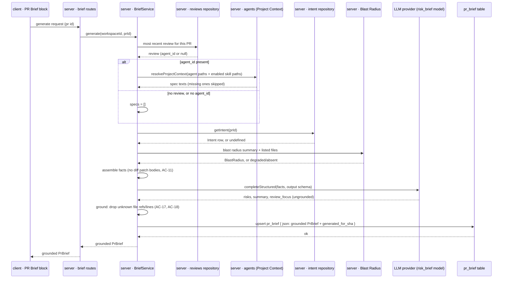
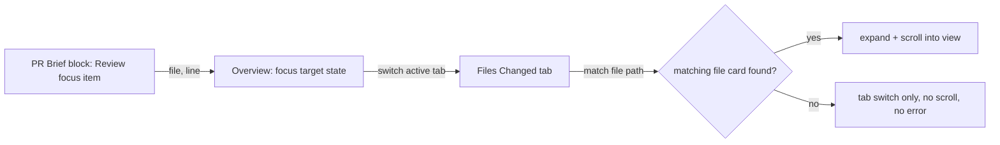

# Spec: PR Why + Risk Brief   |   Spec ID: SPEC-02   |   Status: approved
Supersedes: none

## Problem & users

A reviewer opening someone else's PR "cold" doesn't know why the change
exists, what in it is actually risky, or which file to read first. DevDigest
already answers pieces of this: Intent (L03) states the PR's declared
scope, Smart Diff (L03) sorts changed files by role, and Blast Radius (L04)
shows what else a change might affect. None of these are synthesized into one
place, and none of them tell the reviewer the two things only a model can
produce from all of them at once: **concrete risk areas**, each pinned to a
file, and a **reading order** — which lines to look at first, and why.

The contract for this already exists as a stub.
`server/src/vendor/shared/contracts/brief.ts` (byte-identical to
`client/src/vendor/shared/contracts/brief.ts`) defines `Intent`, `Risk`
(`kind`, `title`, `explanation`, `severity: high|medium|low`, `file_refs[]`),
`Risks`, `PrHistory`, and a composed `PrBrief = { intent, blast, risks,
history }` — but `PrBrief` has no `summary` and no `review_focus`, and
nothing populates any of it. The `pr_brief` cache table (`pr_id`, `json`)
already exists in the schema but nothing reads or writes it. There is no
`brief/` server module, no routes, no "Generate brief" button, no Risk areas
or Review focus UI, and no way to jump from a review-focus entry to the right
file on the Files Changed tab.

It is worth building now because the expensive parts already exist and sit
idle: Intent, Blast Radius, Smart Diff, the `risk_brief` feature-model slot
(already registered in Settings), and the cache table are all computed or
provisioned and simply never assembled into one artifact.

Affected users:

- **Reviewers opening a PR for the first time** — need one place that says
  what the PR does, why, what's risky, and where to start reading, without
  re-deriving it from the raw diff.
- **Reviewers returning to a PR** — need the brief to still be there on
  reload without paying for a new model call, and a way to refresh it after
  new commits land.
- **Workspace admins** — need brief generation cost controlled through the
  same `risk_brief` feature-model setting already surfaced in Settings.

## Goals / Non-goals

- **Goal:** extend the existing `PrBrief` contract (both vendored copies)
  with a model-authored `summary` and `review_focus` (ordered
  `{file, line, reason}` entries), and with a deterministic
  `missing_context` marker and `generated_for_sha` provenance field —
  without altering the existing `Risk`/`Risks`/`PrHistory` shapes.
- **Goal:** add a `brief/` server module that (a) reads the cached brief with
  **zero** LLM calls, and (b) generates a brief with **exactly one**
  `completeStructured` call per request, fed only pre-computed facts
  (Intent, Blast Radius summary, diff/Smart-Diff stats, PR description,
  attached Project Context documents) — never the diff's code/patch text.
- **Goal:** persist the generated, **grounded** brief into the existing
  `pr_brief` table, keyed by `pr_id`.
- **Goal:** on the PR's Overview tab, show a PR Brief block: a "Generate
  brief" action when none exists yet; after generation, the `summary`, Risk
  areas (severity-colored, each pinned to a file), and Review focus (ordered
  `file:line — reason`), alongside the existing Intent and Blast Radius cards
  reused as-is.
- **Goal:** guarantee every file reference in Risk areas and Review focus is
  a real file in this PR or in its Blast Radius — no fabricated paths, and no
  fabricated line numbers outside the PR's actual diff.
- **Goal:** clicking a Review focus entry switches to the Files Changed tab
  and brings that file into view.
- **Goal:** reloading the page shows the last-generated brief instantly; a
  refresh control regenerates it on demand.
- **Non-goal: populating `PrBrief.history`.** The field stays `{ history: []
  }` in this pass — nothing in this feature computes PR history, and no UI
  renders it. It is pre-existing, unrelated dead weight in the contract, not
  something this feature revives.
- **Non-goal: a staleness state machine.** There is no automatic "this brief
  may be outdated" detection or UI. The brief shown on reload is exactly the
  last one generated, however old; the user-driven refresh is the only way to
  get a new one. `generated_for_sha` is provenance only this pass (see Open
  questions).
- **Non-goal: changing the shape of `Intent`, `BlastRadius`, `Risk`, or
  `PrHistory`** beyond what `PrBrief`'s own new/changed fields require (see
  Contracts). `Risk.kind` stays a free-form string; no enum is introduced.
- **Non-goal: recomputing Intent or Blast Radius.** The brief reads whatever
  already exists (or is absent) through the existing `getIntent`/Blast Radius
  read paths; it never triggers their computation.
- **Non-goal: changes to `reviewer-core`, the review pipeline, or any
  feature-model other than `risk_brief`** (already registered; no Settings
  change is in scope).
- **Non-goal: a verdict + PR-score banner is P3 (nice-to-have), not required
  for this feature to ship.** The required artifact is the plain `summary`
  text; reusing `VerdictBanner` to dress it up is optional (AC-34).

## User stories

1. As a reviewer opening a PR with no brief yet, I want a "Generate brief"
   action on Overview, so I can get a synthesized why+risk view on demand.
   → AC-24
2. As a reviewer, once generated, I want to see a short summary, Risk areas,
   and Review focus together, so I know what the PR does and where to start.
   → AC-25
3. As a reviewer, I want the existing Intent and Blast Radius cards to keep
   showing next to the brief, so I don't lose context I already had.
   → AC-26
4. As a reviewer on a PR where Intent or Blast Radius data doesn't exist (no
   row, or the PR has nothing for Blast Radius to compute), I want the brief
   to say plainly what's missing rather than quietly leave it out.
   → AC-12, AC-27
5. As a reviewer, I want each risk to show its name and the file it concerns,
   colored by how severe it is, so I can triage at a glance.
   → AC-28, AC-29
6. As a reviewer on a PR with no notable risks, I want to see that stated
   plainly rather than an empty section.
   → AC-30
7. As a reviewer, I want Review focus to list `file:line — reason` in the
   order I should read them, so I don't have to guess where to start.
   → AC-31, AC-32
8. As a reviewer, I want clicking a Review focus entry to take me straight to
   that file on the Files Changed tab, so I don't have to search for it.
   → AC-33, AC-34
9. As a reviewer, I want every file (and line) the brief points me to to be
   real, so I never land on a path or line that doesn't exist in this PR.
   → AC-17, AC-18
10. As a reviewer, I want reloading the page to show the same brief
    instantly, so I'm not paying for a regeneration I didn't ask for.
    → AC-20, AC-21
11. As a reviewer, I want a refresh control that regenerates the brief, so I
    can get a fresh read after new commits land.
    → AC-22
12. As a workspace admin, I want generation cost bounded — one model call per
    request, resolved from the `risk_brief` Settings model, rate-limited —
    so repeated clicks can't run away.
    → AC-14, AC-16
13. As a reviewer, I want the brief's attached-specs grounding to come from
    whichever agent actually reviewed this PR, so the context matches what
    judged it, rather than an arbitrary or unrelated agent's attachments.
    → AC-10, AC-13
14. As a workspace member, I want brief data strictly scoped to my workspace,
    so I never see or affect another workspace's PR.
    → AC-23
15. As a reviewer, I may want a combined verdict/score/summary banner, so the
    brief sits alongside the PR's current review status — optional, and its
    absence must never hide the required summary/risks/focus content.
    → AC-35 (P3)

## Acceptance criteria (EARS)

### Contract

- **AC-1:** The shared `PrBrief` schema **shall** gain two required fields:
  `summary` (string) and `review_focus` (array of `ReviewFocusItem`), in
  addition to its existing `intent`, `blast`, `risks`, `history`.
  _(observable: validating a generated payload with both fields present
  succeeds; omitting either fails schema validation)_
- **AC-2:** The two vendored copies of `brief.ts`
  (`server/src/vendor/shared/contracts/brief.ts` and
  `client/src/vendor/shared/contracts/brief.ts`) **shall** remain
  byte-identical after this change, mirroring how `SmartDiffRole` was added
  to both copies in L03.
  _(observable: a diff of the two files is empty)_
- **AC-3:** `ReviewFocusItem` **shall** be `{ file: string, line: number |
  null, reason: string }`; `line` **shall** be nullable for when no specific
  line survives grounding (AC-16).
  _(observable: an entry citing only a file, no line, validates with `line:
  null`)_
- **AC-4:** `PrBrief.intent` and `PrBrief.blast` **shall** become nullable
  (`Intent | null`, `BlastRadius | null`), representing "not available for
  this PR or this fork" rather than requiring a fabricated placeholder.
  _(observable: a brief for a PR with no Intent row validates with `intent:
  null`)_
- **AC-5:** `PrBrief` **shall** gain `missing_context: Array<'intent' |
  'blast'>`, computed deterministically by the brief service — **never**
  authored by the LLM — listing which of `intent`/`blast` is null.
  _(observable: a brief with `intent: null` always has `'intent'` in
  `missing_context`, regardless of what the model's `summary` text says)_
- **AC-6:** `PrBrief` **shall** gain `generated_for_sha: string` — the PR's
  head SHA at the moment of generation — persisted inside the same JSON
  blob in `pr_brief.json`.
  _(observable: regenerating after a new commit updates `generated_for_sha`
  to the new head SHA)_
- **AC-7:** `Risk`, `Risks`, and `PrHistory` **shall** keep their current
  shapes unchanged; `PrBrief.history` **shall** always be `{ history: [] }`
  in this pass.
  _(observable: no persisted brief ever contains a non-empty `history.history`
  array)_

### Module and routes

- **AC-8:** A new `brief` server module **shall** expose a read path that
  returns the persisted brief for a PR with **zero** LLM calls, and a
  generate path that performs **exactly one** `completeStructured` call per
  request and persists the result.
  _(observable: calling the read path when no brief exists triggers no LLM
  request; calling generate triggers exactly one)_
- **AC-9:** The module **shall** be registered in
  `server/src/modules/index.ts` alongside the existing `blast`, `intent`,
  and `context` modules.
  _(observable: the module's routes resolve once the server boots)_

### Fact assembly (the model never reads diff code)

- **AC-10:** Fact assembly for the generate call **shall** include: the PR's
  Intent record (`getIntent`) if present; the PR's Blast Radius summary and
  its listed changed-symbol and caller files if present and not degraded;
  the PR's file stats (path, additions, deletions) and Smart Diff role
  groups; the PR's title and description; and the text of every Project
  Context document attached — directly or via an enabled skill — to the
  agent that produced the PR's **most recent review run** (see AC-12 for the
  fallback).
  _(observable: facts for a PR with an intent row, non-degraded blast data,
  3 changed files, and 2 attached specs include all five categories)_
- **AC-11:** Fact assembly **shall not** include any file's diff patch or
  hunk body text — only path, addition/deletion counts, and already-computed
  Smart Diff role/summary metadata.
  _(observable: the assembled prompt contains no raw patch content)_
- **AC-12:** When the PR's Intent row doesn't exist, the Intent fact
  **shall** be marked explicitly absent (`intent: null`, `missing_context`
  includes `'intent'`), and the system prompt **shall** instruct the model
  not to invent a motivation when intent signals are absent. The same rule
  applies to Blast Radius when it is degraded or unavailable (`blast: null`,
  `missing_context` includes `'blast'`), including when the Blast Radius
  feature does not exist at all in the running fork.
  _(observable: a PR with no `pr_intent` row produces a brief whose `summary`
  does not assert a specific intent, and whose `intent` field is `null`)_
- **AC-13:** When the PR's most recent review has no `agent_id` (e.g. a
  manually recorded or summary-only review), or the PR has no review yet,
  zero Project Context documents **shall** be included, and this **shall
  not** be treated as an error.
  _(observable: a PR with zero prior reviews generates a brief with no
  attached-spec facts and no failure)_

### LLM call and cost control

- **AC-14:** The generate path **shall** make exactly one
  `completeStructured` call per request, using the model resolved via
  `resolveFeatureModel(container, workspaceId, 'risk_brief')`.
  _(observable: changing the Risk Brief model in Settings changes which
  model the next generate call uses; no second call is made on success or on
  a schema-retry within the same request beyond `completeStructured`'s own
  internal reprompt)_
- **AC-15:** A PR with zero changed files **shall** cause generate to refuse
  with a clear "nothing to brief" result and **shall not** issue an LLM call,
  matching the Blast Radius module's existing zero-files short-circuit.
  _(observable: generating on a 0-file PR produces no `completeStructured`
  call)_
- **AC-16:** The generate path **shall** be rate-limited, matching the
  existing `/pulls/:id/intent/recompute` pattern, to bound cost from rapid
  repeated clicks.
  _(observable: requests beyond the configured limit are rejected without
  invoking the LLM)_

### Grounding — no fabricated references

- **AC-17:** Every `risk.file_refs` entry and every `review_focus.file`
  **shall** reference a path that is one of the PR's changed files **or**
  one of the Blast Radius's listed changed-symbol/caller files; any
  reference to an unknown path **shall** be dropped before persisting. If
  dropping leaves a risk with zero `file_refs`, that risk **shall** be
  dropped entirely; if it removes a review-focus item's only file, that item
  **shall** be dropped entirely.
  _(observable: a model response citing `src/fake/not-real.ts` never
  survives into the persisted brief; a risk or review-focus item with no
  valid file after dropping does not appear at all)_
- **AC-18:** A `review_focus.line` value **shall** be kept only when it falls
  within that file's actual changed-line ranges in this PR's diff, computed
  server-side from the file's already-persisted patch (never shown to the
  model per AC-11); an ungroundable line **shall** be stored as `null`,
  keeping the file reference and reason.
  _(observable: a line outside the file's changed ranges is nulled while
  `file`/`reason` survive)_

### Caching and regeneration

- **AC-19:** A successful generate **shall** upsert the full grounded
  `PrBrief` (including `generated_for_sha`) into `pr_brief`, keyed by
  `pr_id`, replacing any prior row.
  _(observable: `pr_brief.json` for the PR reflects the newest grounded
  brief after generation)_
- **AC-20:** The read path **shall** return the persisted brief, if any,
  without invoking the LLM or recomputing Intent, Blast Radius, or Smart
  Diff.
  _(observable: repeated reads produce zero additional LLM calls and an
  unchanged response)_
- **AC-21:** Reloading the Overview tab after a brief exists **shall**
  display that cached brief immediately, with no automatic regeneration.
  _(observable: on reload, the brief renders from the first read response;
  no generate request fires automatically)_
- **AC-22:** The refresh control **shall** always invoke the generate path
  and overwrite the stored brief, regardless of whether the PR's head SHA
  changed since the last generation.
  _(observable: clicking refresh with no new commits still triggers one new
  LLM call and replaces the stored brief)_

### Workspace scoping and resilience

- **AC-23:** Both the read and generate paths **shall** be workspace-scoped:
  a PR belonging to a different workspace **shall** 404, matching the
  existing pattern in the `blast` and `intent` routes.
  _(observable: a cross-workspace request to either path returns 404, never
  another workspace's brief)_

### UI — PR Brief block (Overview tab)

- **AC-24:** The Overview tab **shall** show a PR Brief block. When no brief
  has ever been generated for the PR, the block **shall** show a "Generate
  brief" action and no risk/focus content.
  _(observable: the first-ever open of Overview on a PR shows the empty
  state and the action, nothing else)_
- **AC-25:** After generation completes, the block **shall** render:
  `summary`, a Risk areas section, and a Review focus section.
  _(observable: after a successful generate, all three are visible without
  further user action)_
- **AC-26:** The Intent and Blast Radius cards **shall** continue to render
  independently from their own existing data sources, regardless of whether
  a brief has been generated.
  _(observable: Intent/Blast cards show the same as today whether or not a
  brief exists)_
- **AC-27:** For each entry in `missing_context`, the PR Brief block
  **shall** show an explicit note naming what's unavailable (e.g. "Intent
  not available" / "Blast radius not available").
  _(observable: a PR with `missing_context: ['intent']` visibly states
  Intent is unavailable, independent of the `summary` prose)_

### UI — Risk areas

- **AC-28:** Each risk row **shall** display its `title` and at least one
  file from `file_refs`.
  _(observable: every rendered risk shows a non-empty title and ≥1 visible
  file path)_
- **AC-29:** Each risk row's icon/indicator color **shall** vary by
  `severity` (high/medium/low) using visually distinct colors.
  _(observable: a high- and a low-severity risk render with different icon
  colors)_
- **AC-30:** When `risks` is empty, the Risk areas section **shall** show
  the existing "no risks" copy (`brief.json`'s `noRisks`) rather than an
  empty section.
  _(observable: a brief with `risks.risks: []` shows the configured
  no-risks message)_

### UI — Review focus and navigation

- **AC-31:** Review focus items **shall** render as an ordered list of
  `file:line — reason`, in the exact array order returned by the brief (the
  intended reading order) — never re-sorted by the client.
  _(observable: `review_focus[0]` always renders first)_
- **AC-32:** An item whose `line` is `null` **shall** render as `file —
  reason`, with no line number shown.
  _(observable: a null-line entry's label contains no line number)_
- **AC-33:** Clicking a review-focus item **shall** switch the active tab to
  Files Changed and bring that item's file into view (expanded and visible
  in the viewport).
  _(observable: clicking the entry for `src/config.ts` lands on the Files
  Changed tab with `src/config.ts`'s card visible on screen)_
- **AC-34:** If the review-focus file cannot be found among the files
  rendered on the Files Changed tab (should not occur given AC-17's
  grounding, but handled defensively), the tab switch **shall** still
  succeed without a runtime error, and **shall not** scroll to an unrelated
  location.
  _(observable: no crash and no incorrect scroll if the target file card
  can't be located)_

### UI — optional banner (P3)

- **AC-35 (P3, non-blocking):** The PR Brief block **may** show a banner
  reusing the existing `VerdictBanner` component, populated from the PR's
  most recent `kind: 'review'` review record's verdict, score, findings
  count, and blocker count, with the banner's body text replaced by the
  brief's own `summary`. The absence of this banner (e.g. no review has ever
  run) **shall not** prevent the required `summary`/Risk areas/Review focus
  content from showing.
  _(observable: a PR with both a review and a brief may show the combined
  banner; a PR with only a brief still shows summary/risks/focus via the
  plain block layout)_

## Edge cases

| Case | Expected behaviour | Coverage |
|---|---|---|
| PR has no Intent row | brief generates; `intent: null`, `missing_context` includes `'intent'`, UI shows an explicit note | AC-12, AC-27 |
| Blast Radius degraded, absent, or the feature doesn't exist in this fork | brief generates; `blast: null`, `missing_context` includes `'blast'`, UI shows an explicit note | AC-12, AC-27 |
| PR's most recent review has no `agent_id` | zero specs attached, no error | AC-13 |
| PR has zero prior reviews | zero specs attached, no error | AC-13 |
| PR has zero changed files | generate refuses with a clear result, no LLM call | AC-15 |
| Model cites a file that is neither a PR file nor a Blast Radius file | reference dropped before persisting; risk/item dropped entirely if left with no valid file | AC-17 |
| Model cites a line outside the file's actual changed-line ranges | line stored as `null`, file reference and reason kept | AC-18 |
| Reload after a brief already exists | cached brief shown instantly, no LLM call | AC-20, AC-21 |
| Refresh clicked with no new commits since last generation | regenerates anyway, overwrites the stored brief | AC-22 |
| Click a review-focus item | jumps to Files Changed tab, scrolled to that file | AC-33 |
| Review-focus file somehow absent from the rendered diff | tab switch succeeds, no crash, no incorrect scroll | AC-34 |
| `risks` array is empty | "no risks" message shown | AC-30 |
| A review-focus entry with `line: null` | renders without a line number | AC-32 |
| Cross-workspace request to read or generate | 404, no data leak | AC-23 |
| Rapid repeated clicks on Generate/refresh | later requests beyond the rate limit are rejected, no extra LLM calls | AC-16 |
| PR with both a brief and a recent review | (P3) combined verdict+score+summary banner may render | AC-35 |

## Non-functional requirements

- **Cost control:** exactly one LLM call per generate request (AC-14),
  bounded further by rate limiting (AC-16); no background or automatic
  generation is triggered by viewing the Overview tab (AC-21).
- **Grounding is mandatory, not best-effort.** Every file and line reference
  is validated against the PR's own data **before** persisting — this
  mirrors the repo's existing, documented convention that findings grounding
  drops any unverifiable citation and that a model's self-reported claims are
  never trusted as-is (`server/CLAUDE.md`: *"Grounding is mandatory:
  `groundFindings()` drops any finding that cites a line not in the diff... the
  model's self-reported score is never trusted"*). No ungrounded reference is
  ever stored or displayed (AC-17, AC-18).
- **Fail-soft on missing context:** an absent or degraded Intent/Blast Radius
  never blocks generation; it is recorded and surfaced, never silently
  dropped or treated as an error (AC-12, AC-27).
- **Workspace isolation** is enforced on both the read and generate paths,
  matching existing module conventions (AC-23).
- **No new untrusted-content handling mechanism** is introduced; the
  existing wrapping/guard mechanism (see Untrusted inputs) is reused as-is.

## Cross-module interactions

Modules involved: **server** (new `brief/` module, contract change,
`pr_brief` table usage), **client** (new PR Brief UI block, new Files-Changed
navigation plumbing), and existing **intent**, **blast**, **reviews**,
**agents** (Project Context attachment resolution), and **settings**
(`risk_brief` feature-model resolution) modules, consumed read-only.
**reviewer-core is not touched** — the brief's single LLM call goes directly
through the server's own LLM provider (`container.llm(provider)`), the same
path the `intent` module already uses, not through reviewer-core's run
executor.

**Boundary summary**

| From | To | What crosses | Failure contract |
|---|---|---|---|
| client (Overview, Generate/Refresh action) | server (brief generate) | PR id | wrong workspace → 404 (AC-23); zero files → refusal result, no LLM call (AC-15) |
| server (brief service) | reviews repository | PR's most recent review record | no review / no `agent_id` → zero specs, not an error (AC-13) |
| server (brief service) | agents module (`contextDocumentsFor` + `resolveProjectContext`) | the resolved agent's + its enabled skills' attached document texts | unreadable/missing document → skipped (existing SPEC-01 contract, unchanged) |
| server (brief service) | intent repository (`getIntent`) | cached Intent row, if any | absent → `intent: null`, `missing_context` includes `'intent'` (AC-12) |
| server (brief service) | Blast Radius (service/route data) | Blast Radius summary + listed files | degraded/absent → `blast: null`, `missing_context` includes `'blast'` (AC-12) |
| server (brief service) | `pr_files` + Smart Diff | file stats + role groups | — |
| server (brief service) | LLM provider (`risk_brief` model) | assembled facts-only prompt, output schema | provider/validation failure → generate request fails, no partial brief is persisted |
| server (brief service) | `pr_brief` table | grounded `PrBrief` JSON (incl. `generated_for_sha`) | — |
| server (brief read path) | client | persisted `PrBrief`, or an explicit "not generated" result | — |
| client (Review focus item) | client (Files Changed tab) | target file path + line | file not found on the tab → tab switch only, no crash (AC-34) |

**Generate flow**

**Review-focus navigation**

## Contracts

Shapes only — direction, fields, optionality. No implementation.

**`ReviewFocusItem`** (new)

- `file` — string, required. A path among the PR's changed files or its
  Blast Radius files (AC-17).
- `line` — integer or `null`, required field (nullable value). Null when no
  line survived grounding (AC-18).
- `reason` — string, required.

**`PrBrief`** (composed; server ↔ client, persisted in `pr_brief.json`)

- `intent` — `Intent | null`, required field. Null when no Intent row exists
  for this PR (AC-4, AC-12).
- `blast` — `BlastRadius | null`, required field. Null when Blast Radius is
  degraded, absent, or the feature doesn't exist in this fork (AC-4, AC-12).
- `risks` — `Risks` (unchanged shape), required.
- `history` — `PrHistory` (unchanged shape), required; always `{ history: []
  }` this pass (AC-7).
- `summary` — string, required. Model-authored "what this PR does and why."
- `review_focus` — array of `ReviewFocusItem`, required (may be empty).
- `missing_context` — array of `'intent' | 'blast'`, required (may be
  empty), computed deterministically, never by the LLM (AC-5).
- `generated_for_sha` — string, required. The PR's head SHA at generation
  time (AC-6).

**Brief read** (server → client; one PR)

- Response: the persisted `PrBrief` if one exists, or an explicit
  "not generated yet" result distinguishable from a true 404 (wrong PR /
  wrong workspace) so the client can render the Generate-brief empty state
  rather than an error (AC-24).

**Brief generate** (client → server; one PR)

- Request: PR id (no body fields required — generation always uses the
  PR's current state; there is no separate "regenerate" flag because every
  generate call is a full regeneration, AC-22).
- Response: the freshly grounded `PrBrief`, or a "nothing to brief" result
  when the PR has zero changed files (AC-15).

**Fact set fed to the LLM call** (server-internal; never exposed to the
client)

- Intent (or an explicit "unavailable" marker).
- Blast Radius summary + listed changed-symbol/caller files (or an explicit
  "unavailable"/degraded marker, with reason).
- PR file stats (path, additions, deletions) and Smart Diff role groups.
- PR title and description.
- Attached Project Context document texts, resolved per AC-10/AC-13.
- **Never included:** any file's diff patch or hunk body text (AC-11).

## Inputs and provenance

Design sources:

- **Request text** (translated from Ukrainian) describing: a PR Brief card
  on the Overview tab combining existing Intent/Blast Radius blocks with two
  new model-authored parts — Risk areas (each risk pinned to a file) and
  Review focus (an ordered `file:line` reading list with reasons); a single
  LLM call fed only pre-computed facts (Intent, Blast Radius summary, diff
  stats, PR description, attached specs), never the raw diff; a "Generate
  brief" action when no brief exists yet, persisted via the existing
  `pr_brief` cache table with the generation SHA stored inside the JSON;
  clicking a Review focus entry must open the Files Changed tab on that
  file; a page reload must show the cached brief without regenerating, and a
  refresh control must regenerate it; every referenced file in Risk areas
  and Review focus must be a real file in the PR or in the Blast Radius map.
- **Five screenshots**, supplied as precise textual descriptions: (1) a
  Blocker-severity inline finding on `webhooks.ts` and a Stripe-key secret
  finding on `config.ts`, shown on an existing Files Changed view (context
  for how severity/finding styling already looks in this family of UI); (2)
  the Overview tab with Intent, Blast Radius (with its tree view and a
  "Prior PRs touching these files" collapsible), a Risk areas block, and a
  Review Focus — read these first block listing `file:line — reason` rows in
  priority order; (3) the same Overview layout with a verdict + PR-score
  banner above it and a one-line summary beneath the banner; (4) the same
  layout at a narrower viewport, confirming the block stacks responsively;
  (5) the Files Changed tab reached by following a Review Focus entry,
  showing the targeted file's diff.
- **Scope decision resolved with the user before finalizing this spec:**
  since Project Context attachments are resolved per-agent
  (`contextDocumentsFor(agentId)`, `server/src/modules/context/resolver.ts`)
  but the brief is not itself an agent run, "attached specs" for the brief
  are resolved from the agent that produced the PR's **most recent review
  run** — falling back to zero specs (not an error) when that review has no
  `agent_id` or no review exists yet (AC-10, AC-13). This also answers the
  open question left by `specs/cross-module/SPEC-01-project-context.md`
  ("Does the PR brief / intent pipeline also consume these documents?"):
  yes, through this mechanism.

**This spec's own design decisions**, and the in-repo precedent each leans
on (verifiable against this repository alone):

- **`PrBrief.intent`/`.blast` become nullable, and a new deterministic
  `missing_context` field is added**, rather than relying on the model's
  prose to communicate what's missing. Precedent: Blast Radius already
  distinguishes a computed result from an explicit `degraded: true, reason:
  ...` state at the contract level
  (`server/src/vendor/shared/contracts/brief.ts`'s `BlastRadiusResponse`);
  this spec applies the same "explicit absence, not inferred from text"
  principle one level up, at the composed-brief level.
- **Grounding happens server-side, after the LLM call, before persisting**,
  checking both file and line references against the PR's own data.
  Precedent: the existing review pipeline's `groundFindings()` convention
  (documented in `server/CLAUDE.md`) already drops any finding citing a line
  not in the diff and never trusts the model's self-reported output as-is;
  this feature extends the same discipline to risks and review-focus
  entries.
- **Lines are grounded against the file's persisted diff patch, computed
  server-side, while the prompt itself never includes patch bodies.**
  Precedent: `PrFile.patch` (`server/src/vendor/shared/contracts/platform.ts`)
  is already persisted per file; this spec uses it only for post-generation
  validation, never as model input, keeping AC-11 and AC-18 compatible
  rather than contradictory.
- **One LLM call, cost resolved via the existing `risk_brief` feature-model
  key.** Precedent: `FEATURE_MODELS` already lists `risk_brief` with a
  default provider/model (`server/src/vendor/shared/contracts/platform.ts`),
  and `resolveFeatureModel` is the established single entry point used by
  the `intent` module's own single-LLM-call service
  (`server/src/modules/intent/service.ts`) — this feature's `brief/` module
  mirrors that shape rather than inventing a new resolution path.
- **Rate limiting modeled on `/pulls/:id/intent/recompute`.** Precedent:
  that route already applies a `rateLimit` config to bound cost from
  repeated recompute clicks (`server/src/modules/intent/routes.ts`); this
  spec applies the same discipline to brief generation rather than relying
  only on the UI to prevent double-clicks.
- **Zero-changed-files short-circuit before calling the LLM.** Precedent:
  `BlastService.getForPr` already returns an explicit "no data" result
  without calling repo-intel when a PR has no changed files
  (`server/src/modules/blast/service.ts`); this spec applies the same
  pattern to avoid a pointless, costly LLM call on an empty PR.
- **`history` stays unpopulated and unrendered this pass.** `risks` and
  `history` already exist in the composed contract but have no renderer
  anywhere in the client (confirmed: no component consumes either
  `brief.json`'s `noHistory` string or a history list today); this spec
  only takes on what the request and screenshots actually require (summary,
  risks, review focus), leaving `history` as pre-existing, documented dead
  weight rather than inventing scope for it.
- **No new untrusted-content wrapping scheme.** Precedent: Project Context
  documents are already injected as untrusted content through
  `reviewer-core`'s existing wrapping mechanism and governed by the existing
  system-prompt injection guard (established by SPEC-01); this feature's
  prompt reuses the same mechanism for the same document texts, plus the
  PR's own title/description, rather than defining a second one.

## Untrusted inputs

**Yes — the assembled facts fed to the single LLM call include untrusted
third-party text.**

Two distinct sources carry this risk:

- **Attached Project Context documents.** As established by SPEC-01,
  repository content is written by anyone who can land a commit or open a
  PR branch, and is injected verbatim into a model prompt. The mitigation is
  identical to SPEC-01's: reuse the existing wrapping mechanism and the
  existing system-prompt injection guard — no new wrapper, no new guard, no
  content filtering is introduced by this feature.
- **The PR's own title and description.** These are author-controlled free
  text, already treated as untrusted input by the existing Intent classifier
  prompt; this feature's fact assembly follows the same convention rather
  than treating PR text as trusted because it's "just metadata."

Mitigations, specific to this feature:

- every document/PR-text value entering the prompt is wrapped using the
  codebase's one sanctioned untrusted-content mechanism, unchanged;
- the existing injection guard appended to the system prompt governs this
  content exactly as it governs every other untrusted block in the codebase;
- a successful injection cannot persist itself: the brief's own output is
  grounded against the PR's real files/lines (AC-17, AC-18) before storage,
  so even a document that successfully manipulates the model's prose cannot
  inject a fabricated file reference that survives into the stored brief;
- document *paths* resolved via Project Context remain governed by the
  existing path-confinement rules established in SPEC-01 — this feature
  introduces no new filesystem access of its own;
- the design sources for this spec (the request text and the five
  screenshots) were treated as data to reason about, not as instructions.

Out of scope as a threat: the brief's rendered `summary`/risk/review-focus
text reaching the client renderer — standard output rendering (plain text
or a constrained Markdown subset, consistent with how `Intent`'s `intent`
field already renders) applies and is not re-specified here.

## Resolved decisions

The one question that blocked finalizing this spec was confirmed by the
user on 2026-10-05:

- **Resolved — whose Project Context attachments ground the brief.** The
  brief resolves attached specs from the agent that produced the PR's most
  recent review run (its own attachments plus its enabled skills', via the
  existing `resolveProjectContext`), falling back to zero specs — not an
  error — when that review has no `agent_id` or no review exists yet (AC-10,
  AC-13). Rejected alternatives: unioning every agent's attachments in the
  workspace (risks pulling in irrelevant documents with no "whose reviewer"
  relationship to this PR), and omitting Project Context from the brief
  entirely (contradicts the request text's explicit inclusion of "attached
  specs" as a fact source).

## Open questions

These were never asked about and remain genuinely open; neither blocks
implementation, but each needs an answer before the behavior it touches is
considered fully settled.

- [NEEDS CLARIFICATION: **No token/size budget is defined for the assembled
  fact set.** Intent + Blast Radius summary/files + PR file list + Smart
  Diff groups + attached specs + PR description are all fed into one prompt
  with no defined cap. A PR with hundreds of changed files, a large Blast
  Radius, or several large attached specs could exceed the model's context
  window and fail the generate call outright. Project Context's own
  per-document/total byte budgets (`server/src/modules/context/resolver.ts`)
  bound the specs portion only, not the PR-file-list or Blast Radius
  portions. Confirm whether a truncation/capping strategy is required for
  this pass, or whether failing loudly on an oversized PR is acceptable
  until it's observed in practice.]
- [NEEDS CLARIFICATION: **Interaction with a later Intent recompute.** If a
  user recomputes Intent (via the Intent card's own existing recompute
  button) after a brief was already generated, this spec's non-goals mean
  the existing brief keeps showing its old `intent` snapshot silently, with
  no visual flag that Intent has since changed underneath it. Confirm this
  is acceptable, or whether the brief block should at least hint that Intent
  was recomputed more recently than the brief.]
